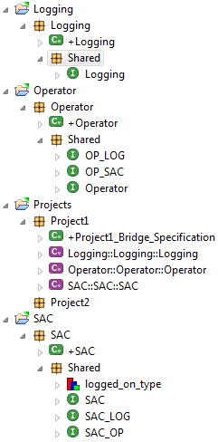
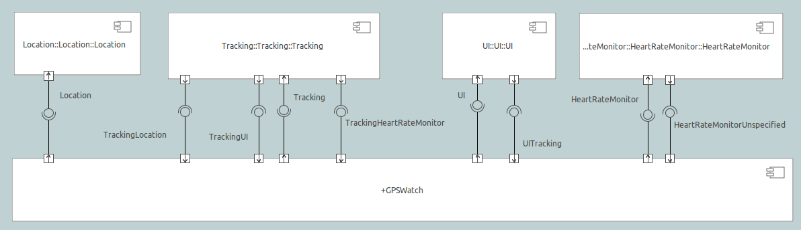

MASL Modeling and Conversion Guide
===================
     
Introduction
------------
BridgePoint xtUML is designed to support the executable, translatable UML (xtUML) approach 
to the Shlaer-Mellor methodology for Model-Driven Architecture (MDA). However, xtUML is not 
the only language to have its roots in this MDA approach. MASL  is another dialect that has 
evolved from the Shlaer-Mellor methodology and developed a community of users. Now this common 
ancestry offers modelers in either community the potential to move models between the two 
dialects. BridgePoint xtUML is an editing and execution platform for xtUML modelers. With the 
addition of conversion tools, extensions to import/export facilities and a MASL-aware editor, 
BridgePoint xtUML is a powerful platform for MASL modelers to advance their work and employ 
MASL downstream tools. When moving MASL models into xtUML, an idiom must be followed. This 
document details that idiom and the extensions to the platform that make working with MASL 
inside BridgePoint xtUML possible.     


Terminology and Notation
------------
In this document terms preceded by _MASL_ are as defined in the MASL Reference Manual unless 
otherwise clarified below.   
  
| Term                  | Description                          |
|-----------------------|--------------------------------------|
| __eclipse workspace__ | Implemented as a folder in the filesystem, a workspace can hold any number of xtUML projects. |
| __eclipse project, xtUML project __ | Implemented as a folder in the filesystem, a project can hold any number of xtUML model elements. |
| __domain component__  | An xtUML component representing a MASL domain |
| __domain package__    | An xtUML package containing everything associated with a particular MASL domain, including the domain component for the domain |
| __project component__ | A project-specific xtUML component representing the bridge mappings for the project |
| __project package__   | An xtUML package representing a MASL project |
| __shared type__       | A type used outside a MASL domain, including one used within two or more MASL domains as well as any used on terminator services |
| __eclipse View__      | A graphical presentation of project information |
| __eclipse perspective__ | A collection of Views that provide a consistent presentation of the project information along with tools to manipulate the model |  
  
When describing procedures that involve BridgePoint menus or xtUML model element selections, the 
following notation is used:  

| Action             | Meaning                              |
|--------------------|--------------------------------------|  
| &lt;RMB&gt;        | Right-Mouse Button |
| &lt;click&gt;      | Select using left-mouse button |
| &lt;dbl-click&gt;  | Two rapid &lt;click&gt;s |
| __&lt;Text-in-bold&gt;__  | A menu selection |
| __&lt;Text-in-bold&gt; >__ | A sequence of progressive menu selections |   
  

The MASL - xtUML Modeling Idiom
------------
To ensure that MASL models with its usage of bridging components are accurately  represented 
in xtUML, a set of recommendations and restrictions must be followed. Collectively these form 
the MASL-xtUML idiom and are the foundation for model representation and error-free MASL export 
with BridgePoint xtUML.  
  
Since MASL and xtUML are based on the Shlaer-­Mellor Method, the two languages are similar at the 
core. Consequently, most mappings between constructs in the two languages are straight­forward 
(e.g., MASL Object maps to xtUML Class) and are therefore not detailed here. However, each 
language has been extended differently leading to some mappings that are less obvious, and these 
are explained in the sections below.  
  
The idiom addresses three areas of concern: bridge technologies between domains, model packaging 
to maintain visibility, and Type mapping. By following the practices outlined in the MASL-xtUML 
idiom, models that start as MASL can be converted to xtUML, modified inside the xtUML Editor and 
exported back as MASL for processing by downstream tools.  
  
### Maintaining MASL Bridging Flexibility Inside xtUML

Systems are typically constructed by connecting multiple MASL domains or xtUML components using 
some form of bridging technology. Where MASL employs terminators and public services, xtUML uses 
interfaces consisting of interface operations/signals and ports. The basic mappings between MASL 
and xtUML are simple: a service declared on a terminator corresponds to an interface operation on 
a port while a public service surfaced by a MASL domain is rendered as a function invoked by a 
port activity.  
  
However, MASL bridging provides flexibility in the way MASL domains can communicate. For example, 
a MASL domain may use a subset of the services surfaced by another MASL domain, and it may choose 
to refer to those services by names different than the MASL domain providing them. Also, a forking 
bridge allows a MASL domain to view as a single service two or more services provided by any number 
of MASL domains.  
  
Since xtUML provides bridging based on a single definition for each interface, it is necessary to 
introduce a bridging component into the MASL system that replicates MASL’s flexibility. The idiom 
illustrated below offers the same level of domain isolation in xtUML that the MASL approach affords.  
  
  
__Figure 1__  

In Figure 1, magenta rectangles are references to reusable domain components while the green rectangle 
is a project component that implements the project­-specific bridge requirements.  
  
Each component representing a MASL domain sprouts a single provided interface containing an interface 
operation for each public service surfaced by the MASL domain as declared in the MASL domain interface 
file. This provided interface covers all incoming interface operations for the domain component, and 
the complementary interface is always located on the project component.  

A special naming convention must be followed when creating a MASL Project component (in Figure 1 the
green component) from scratch. After the provided interface is formalized, the port must be renamed
from its default name (e.g. "Port1") to ```<domain>__<terminator>``` with the double-underscore 
separating the domain and terminator names.  

### Deferred Operations

To create a deferred operation, create an operation with an identical signature in each subtype 
class.  Then use the Properties view to set the dialect of the supertype class' operation to
"None".  Each subtype class' operation dialect is set to "MASL".

### MASL projects

There are some situations when the editor must distinguish between a MASL
domain and MASL project. Because domains are where the majority of the work
will take place, no special annotation is needed. For MASL projects however,
the description field of the package that contains a project component must
contain the string "masl_project".

## xtUML Model Packaging for System-wide MASL Visibility

Under xtUML, model elements defined within one component have no knowledge or visibility of model 
elements (including types) defined within another component. This is different from MASL where public 
types defined within a MASL domain can be accessed by other MASL domains using a qualified name of the 
form:  ```otherDomainName::someType```.  Consequently, upon conversion to xtUML, if each MASL domain 
is packaged within a component, this access is lost, and types defined within that MASL domain become 
invisible to other components of the system.  Consequently, provisions in the organization of the 
model are needed to maintain system-wide visibility.  Accordingly, all shared types, including those 
used on terminator services, must be packaged outside domain components. Similar visibility restrictions 
exist for xtUML interface definitions, and the solution is for all xtUML interface definitions exposed 
by the domain component to be packaged outside the domain component representing the MASL domain.  
  
To address these differences in scoping of types and interface definitions, the following packaging 
conventions are recommended.  Each MASL domain converted to an xtUML model contains a single top-level 
domain package which then contains:  

* a single domain component definition representing the MASL domain  
* all shared types and all interface definitions associated with the MASL domain  
  
To support system-side visibility, BridgePoint’s support for inter-project references (IPR) is 
leveraged. The xtUML Project in a workspace that is a MASL Project will enable IPRs and thus will gain 
access to the components and types shared by other (MASL Domain) projects in the workspace.  

  
__Figure 3__  
  
A typical xtUML project using this approach is illustrated in Figure 3. Note that all shared types 
defined in the MASL domain are contained within the Shared package associated with that MASL domain, 
and these type definitions are not included in the component representing the MASL domain. With 
BridgePoint xtUML, the conversion facility produces a single xtUML model file adhering to the 
packaging and naming scheme illustrated. Modelers are free to repackage and rename their models as 
they see fit, so long as these two conditions are met:  

* all elements shared among components are defined outside the components that refer to them  
* all elements associated with a MASL domain reside within the domain package for that MASL domain  
  
For xtUML models, packaged in this way, the export facility produces a MASL domain interface file (```.int```) 
that includes the shared types residing in the package associated with the MASL Domain.  
   
### Keeping xtUML and MASL Types Separate

The MASL type system does not align perfectly with that of xtUML. So during import, no MASL types 
are mapped to xtUML types, and the entire MASL type system is adopted into the xtUML Editor. While 
editing the model, the MASL activities can be freely edited and parameters and attributes can be 
typed with MASL types.  

#### Type Reference

In xtUML typing is established through a link between the model element being typed and a particular 
instance of a type. However, MASL treats a type reference as a first ­class concept which makes typing 
a model element in MASL slightly more complex than it is with xtUML. This is because a type reference 
in MASL can further constrain the type that is applied to the affected model element. Since variable 
declarations exist only within activities expressed in MASL, these references do not receive special 
handling and are kept with the MASL code block.  

To access shared types from other domains in MASL action language, the modeler must copy the ```<other domain>.int```
file into the local project's ```models/``` folder.  

To access shared types from the structural part of the model, the modeler must create a type reference
in the local domain.  This is done by creating a new UDT in the current domain with a special name that 
references the domain where the type actually lives (e.g. ```OtherDom::someType```).  

BridgePoint Extensions for MASL
------------
The MASL extensions added to BridgePoint xtUML involve adding MASL conversion tools, extending 
the BridgePoint Import/Export facilities and adding a MASL-aware Editor. Each of these enhanced 
facilities are described in the sections below.  

### MASL Model Conversion

The conversion of MASL domains and MASL projects into MASL-infused xtUML models is performed 
by the tool ```masl2xtuml``` and is invoked from the command line. The conversion command 
```masl2xtuml```  has the following syntax for MASL domains:  

```masl2xtuml -d <directory path> -o <directory path>```  
  
and for MASL projects  
  
```masl2xtuml -p <directory path> -o <directory path>```  
   
where ```<directory path>``` is any relative or absolute directory path, ```-d``` identifies 
the MASL domain, ```-p``` identifies the MASL project directory and ```-o``` identifies the 
destination directory where the xtUML model file is written to. A complete reference is 
included in the MASL documentation.   
   
The MASL domains and MASL projects are processed one at a time in any order. All conversion 
can be performed sequentially or each conversion can be followed by a BridgePoint model import. 
However, the conversion is incomplete until all MASL domains and at least one MASL project 
have been successfully processed.   
    
Note that MASL models can be converted and imported in any order. However, before importing an 
xtUML model representing a MASL project, all domains referenced by that project must first be 
imported.  
   
#### xtUML Model Packaging for Preserving MASL Activity Blocks

During the conversion from MASL to xtUML, each MASL domain is mapped to a domain component, and 
each project is converted into a project package. Within a MASL domain, activity can be 
associated with public services and terminators at the interface, and data processing within 
the domain through operations, functions, and state machine actions. Once converted these MASL 
action code blocks are kept with the associated xtUML model element, but in separate storage.   
 
###  MASL Import Extension

To translate a MASL model into an xtUML  model inside BridgePoint involves two steps: a 
conversion step and an xtUML import step. The conversion step was discussed in a previous 
section and involves the tool ```masl2xtuml```. The output from this conversion tool is a 
MASL-infused xtUML model file that can be imported into an existing xtUML project using 
the BridgePoint import facility. BridgePoint xtUML import can be achieved interactively 
through the xtUML modeling perspective (see below).   
  
The xtUML import step is a procedure covering three steps: create the xtUML project, enable 
the use of Inter-Project References (IPRs), and finally use xtUML model import to bring 
the ```masl2xtuml``` created MASL-infused xtUML model file into the xtuml project. Each of 
these steps must be repeated for each MASL domain and MASL project.   

It is important to recall that the MASL-xtUML idiom requires system-wide scope for some model 
elements and this is facilitated in BridgePoint using Inter-Project References. For IPRs to 
automatically connect referenced model elements during import, these referenced elements must 
already be in the workspace. Consequently, the project package must only be imported after all 
referenced domain packages have been imported. This is the only import order dependency created 
by the idiom, and all MASL domain packages can be loaded in arbitrary order.   

#### BridgePoint Model Import from the xtUML Modeling Perspective

As described earlier, the MASL-xtUML idiom organizes the BridgePoint workspace based on projects, 
and an xtUML project is needed for each converted domain and project. To perform each import from 
inside BridgePoint, the xtUML modeling perspective is used following these steps:   
   
1. Create an xtUML project using __File > New > xtUML Project__. This command will ask for a name 
which must be unique among all projects in the workspace. A descriptive name that includes a 
connection to the original MASL domain or MASL project is suggested.
2. Enable the IPR preference for the created project using the steps described below.
3. Select __File > Import__ to start a model import. This will open the Import model wizard.
4. Expand the xtUML folder and select xtUML Model from the list of import sources.
5. After __&lt;click&gt;__ ing on Next, enter the full path to the MASL-infused xtUML model file 
to be imported. Pressing the Browse button will open a file browser where __&lt;click&gt;__ s are 
used to navigate through the folder list down to the file to be imported.
6. Once the path is entered, __&lt;click&gt;__ Finish to initiate the import.
7. Upon completion, the Model Explorer view will be updated.
   
### MASL Export Extension

The conversion of xtUML models to MASL is a single step operation that is invoked from either 
the xtUML Editor perspective or a command line. The MASL Export extension consists of the 
```xtuml2masl``` conversion tool and enhancements to the BridgePoint Export facility to support 
the MASL Export Domain or MASL Export Project flows.   

#### MASL Export from the xtUML Modeling Perspective

The steps to export an xtUML model to MASL from BridgePoint start with the Model Explorer view. 
Here the source xtUML project is selected by clicking on the package containing the project to 
be exported as either a MASL domain or MASL project.   

The conversion is activated by selecting __&lt;RMB&gt; > Export MASL domains__ for a domain project 
or __&lt;RMB&gt; > Export MASL project__ for a MASL project. During the export process, progress is 
reported in the Console view, and if errors occur an error log will appear at completion of 
the operation.  
  
#### MASL Export from the Command line

To export xtUML models to MASL equivalent models without invoking the BridgePoint UI, the 
```xtuml2masl``` tool is used. This tool makes use of the environment variable ```WORKSPACE``` 
which must be set to the directory path of the xtUML workspace holding the source xtUML project. 
It is recommended that all xtUML projects be contained in a single workspace, however this is 
not enforced by the export tool. If the complete xtUML model is contained across multiple 
BridgePoint workspaces then the ```WORKSPACE``` variable must be modified between ```xtuml2masl``` 
invocations.   
  
To invoke the MASL export tool, the following syntax is used  
```
xtuml2masl  -i <eclipse project path> -d <package name> [-o <output directory> ]  |  
-i <eclispe project path> -p <package name> [-o <output directory> ]
```  

See the ```xtuml2masl``` reference page in BridgePoint Help for complete details. Note, if 
the ```-o``` parameter is omitted, the current directory is used by default.  

### MASL Editor Extensions

Once a MASL model has been imported as an xtUML project, BridgePoint extensions for MASL 
are accessed through the xtUML Editor perspective. These extensions to the perspective 
enable MASL-aware code editing and MASL export.   
  
#### The xtUML Editor Perspective

When working with xtUML and MASL inside BridgePoint, the xtUML Editor perspective is used 
exclusively. This perspective consists of four primary views:  
* Model Explorer provides easy navigation of the model.  
* Graphical Editor for editing component, class and state machine diagrams. Each diagram 
type provides a palette of drag and drop diagram elements.  
* Console displays error and information messages when models are built.  
* Properties provides access to the list of properties associated with a model element.  
  
Each of these views is documented in the BridgePoint Help facility which can be accessed 
through __Help > Help Contents__.  

A popular addition to the default xtUML Editor perspective is the Navigator view which provides 
easy navigation of the files and directories contained within an xtUML project. This view can 
be added from within BridgePoint by selecting __Window > Show View > Navigator__.
   
Each model element has an Editor that can be opened in a number of ways, and since the xtUML 
Modeling perspective is model-aware, can be opened from within Editors and views. The most 
common view for navigating and opening model elements is the Model Explorer view. In this view, 
model elements can be opened for editing by select the model element and either __&lt;double-click&gt;__ it 
or using  __&lt;RMB&gt; > Open With__ to choose an Editor. Once activated, a new tab will appear in the 
canvas area and the contents of the model element presented inside the Editor.   
  
#### The MASL Editor

Inside a MASL-infused xtUML model, there can be both MASL and OAL activities. To best support 
MASL, the extensions to BridgePoint xtUML include a full featured text editor with MASL syntax 
highlighting.   

The editor will appear when a model element containing MASL is __&lt;dbl-click&gt;__ or when using 
__&lt;RMB&gt; > Open MASL__. In the Navigator view, selecting a ```.masl``` file and __&lt;dbl-click&gt;__ will 
open the MASL editor as well.  

#### When an Action contains both OAL and MASL

Initially, models developed in MASL are unlikely to contain OAL. However, as the model matures 
inside BridgePoint, it is possible that new model content will be a mixture of MASL and OAL with 
some model elements containing both. To Edit these MASL-infused components, select the model 
element from within Model Explorer, and use __&lt;RMB&gt; > Open With__ to choose either the OAL or MASL 
editor options.  

  
__Figure 4__  
  
An alternative means is to set a default choice using the Default Action Language preferences (__Figure 4__). 
The preference is located under __Window > Preferences > xtUML__, and after selecting the button next to 
desired editor, __&lt;click&gt; OK__ to close the window.

#### Inter-Project References and MASL

The MASL-xtUML idiom uses Inter-Project References (IPRs) to provide system-wide scope to some 
model elements. IPRs are a mechanism for xtUML model elements defined in one xtUML project to 
be used in another xtUML project. For the access to be allowed the referring project must have 
IPRs enabled.  
    
To check if IPRs are enabled for a particular xtUML project, select that project in the Model 
Explorer View and then select __&lt;RMB&gt; > Project Preferences__. This will open a popup window (Figure 5), 
and selecting Inter-Project References will show the setting Allow inter-project model references. 
The use of IPRs is enabled if the checkbox is marked. For the models based on the MASL-xtUML idiom, 
all xtUML projects containing a MASL Domain component must have this checkbox unmarked and those xtUML 
projects containing a MASL Project must have this checkbox marked.  For these xtUML/MASL Projects,  
the preference must be set prior to importing the file created by masl2xtuml.
  
  
__Figure 5__  

TODO
When a domain component, shared data type or shared interface is modified, all projects referencing 
that model element will be marked with a warning icon on all affected model elements. There are 
two approaches to resolving these warnings. For projects where the modeler is not the owner of 
the referenced model element then the update must be done using the following steps to pull the 
changes into the project:  

1. Select the project folder in the Model Explorer view.  
2. Synchronize the changes by selecting __&lt;RMB&gt; > Synchronize with Library__  
  
In cases where the modeler is owner of both the referenced and the referring projects then the 
update can be globally pushed from the referenced project to the referring projects using the 
following steps:  

1. Select the project folder in the Model Explorer view.  
2. Synchronize the changes by selecting __&lt;RMB&gt; > Synchronize references__    
  
Appendix A.  the GPS Watch Example
------------
To demonstrate the MASL extensions of BridgePoint xtUML, the GPS Watch example (Figure 6) will 
be used. This model represents an exercise watch that records location, heart rate, and elapsed 
time as the wearer performs a physical activity. The model is composed of four components: a 
heart rate monitor, a location component, a tracking component and a user interface.  

  
__Figure 6__  

### Create a local copy of the MASL model

This model is located in the public GitHub repository at [https://github.com/xtuml/models/tree/master/masl](https://github.com/xtuml/models/tree/master/masl). 
The local copy we will use as the starting point in this tutorial is produced from a ZIP file image 
of this repository.  

1. To produce that ZIP file image, click on the Download ZIP button on the root of the repository webpage 
at [https://github.com/xtuml/models](https://github.com/xtuml/models). Shortly after clicking on the button, a download 
will automatically start.
2. Open a file browser and create a folder named ```Tutorial``` in your home directory
3. With the same file browser navigate to the folder Downloads where the ```models-master.zip``` file 
should reside.
4. Extract the contents of models-master.zip to ```~/Tutorial/```  
  
### Convert the MASL model to xtUML

1. Copy the contents of ```~/Tutorial/model-master/masl/gps/``` to ```~/Tutorial/MASLsrc```
2. Open a terminal window and navigate to the directory ```~/Tutorial/MASLsrc```. In this directory 
you will find the subdirectories GPSWatch, HeartRateMonitor, Location, Tracking and UI.  
3. To convert each MASL domain and MASL project to an equivalent xtUML model the ```masl2xtuml``` tool 
is used. Each of the subdirectories will be converted individually in any order using this tool and 
the converted projects placed in ```~/Tutorial/xtUMLprj```.
4. The command to convert GPSWatch is ```<installation>/tools/mc/bin/masl2xtuml -p GPSWatch -o ../xtUMLprj```
5. The command to convert HeartRateMonitor is ```<installation>/tools/mc/bin/masl2xtuml -d ./HeartRateMonitor -o ../xtUMLprj```
6. Repeat step 5 for the other MASL domains in the directory: Location, Tracking, and UI  
  
At the conclusion, the xtUMLprj directory will contain five subdirectories with names matching 
the five subdirectories under ```~/Tutorial/MASLsrc```.

### Launch BridgePoint xtUML

The first step is to launch BridgePoint xtUML and select an eclipse workspace to hold the modeling 
projects.  

1. To launch BridgePoint xtUML, execute the ```<BridgePoint Home>/bridgepoint```` and during the startup 
of BridgePoint xtUML a workspace selection pop up window will appear.
2. In this window, either type the path to the desired workspace directory or __&lt;click&gt;__ on Browse and 
navigate to this folder.
3. Once entered, __&lt;click&gt; OK__.  
4. BridgePoint will then open on the Welcome page. To open the xtUML Modeling perspective __&lt;click&gt;__ on 
the workbench icon. The Model Explorer View should be empty at this point.  

### Create xtUML projects

Having produced the individual xtUML projects, they are ready to be assembled into an xtUML 
model inside BridgePoint xtUML. The model structure described in an earlier section is used 
here and implemented using the following steps:  
  
1. Create an empty xtUML project using __File > New > xtUML Project__ and give it the name 
HeartRateMonitor.  __&lt;click&gt; Next__. On the model compiler selection page choose “C Model 
Compiler (Source)”. __&lt;click&gt; Finish__.  
2. Import the converted xtUML model using __File > Import__ and select xtUML Model under the xtUML 
folder. Once selected, __&lt;click&gt; Next__.  
3. Browse to the folder ```~/Tutorial/xtUMLprj/HeartRateMonitor``` and check mark HeartRateMonitor 
for the destination.  
4. Repeat steps 1 Through 3 for Location, Tracking and UI models.  
5. The final step is to import the top level project GPSWatch, Again create an empty xtUML project 
using __File > New > xtUML Project__, give it the name GPSWatch.  Select the GPSWatch project in the 
Model Explorer view, then 
__&lt;RMB&gt; > Project Preferences__. This will popup the Project Preferences window and after selecting 
Inter-project References should confirm that the preference Allow inter-project model references 
is checked. If not, __&lt;click&gt;__ on the box and a checkmark will appear.  
6. Import the converted MASL project found in ```~/Tutorial/xtUMLprj/GPSWatch``` into the GPSWatch 
xtUML project.  

### Navigating through the xtUML model

With the model now populated inside the workspace, the various views and editors of BridgePoint 
can be used to visualize, modify and export the model. Navigating around the model can be 
performed from inside either the Model Explorer or Navigator views. Each view employs a tree 
representation of the model and individual model elements can be located using the following steps:  

1. Expand the tree from the project folder down through the model packages by clicking the triangle 
next to the right of the package or model element symbol.  
2. Repeat a until the desired element is revealed in the tree.  
3. To open the model element in a BridgePoint editor, hover over element and then __&lt;dbl-click&gt;__.  

Diagram editors and MASL activity editors are both accessible from Model Explorer. For MASL 
activity blocks, the Navigator view can be used to launch the editor using a similar sequence 
of steps:  

1. By expanding the tree from the project folder down through the model packages and model elements
2. Repeat until the desired ```.masl``` file is revealed in the tree.
3. To open the file in a BridgePoint MASL editor, hover over filename and then __&lt;dbl-click&gt;__.

### Modify MASL

As mentioned previously, when a model contains MASL-infused xtUML model elements, the __&lt;dbl-click&gt;__ 
behavior is based on the default action language preference selection and the given dialect for an 
activity.  
  
In the tutorial model, the Tracking domain contains MASL-infused model elements and MASL code 
will be added to the stopped state within the WorkoutTimer state machine. The steps to make 
this change are:  

1. Inside Model Explorer, expand the tree from the Tracking project folder down through the 
tracking packages and WorkoutTimer class to the stopped state of the Instance State Machine  
2. To open a new MASL activity and associate it with the stopped state, hover over the stopped 
state inside Model Explorer. Next __&lt;RMB&gt; > Open With > MASL Editor__
3. In the MASL editor, add the code  
  
```
public service WorkoutTimer::stopped (user_id : in  integer,
                                      groups  : in  sequence of string) is
                                                   
begin
         console << "Forced activity on workstation. " << endl << flush;
   
end service;    
```
Save the changes and close the editor. Repeat step 3, and this time the MASL code will appear. 
The difference in selection is due to the presence of MASL action language and the selection of 
MASL for Default Editor preference.

### Exporting the MASL-infused xtUML model to MASL domains and MASL projects

The conversion of xtUML projects into MASL domains and MASL projects is conveniently performed 
from the Model Explorer view by first selecting the top package within the xtUML project.  

1. Begin with the xtUML project HeartRateMonitor which is a domain within the GPSWatch model.  
2. Once the package is selected, convert the project into a MASL domain by __&lt;RMB&gt; > Export MASL domains__  
3. When completed the ```export.log``` file will appear. Check the log for Errors or INFO 
messages. During MASL export, a ```masl/``` directory is created in the project if not present and 
the produced MASL files along with the export log will be stored below it. The contents of the 
```masl/``` directory are visible in the Navigator view.   
4. Repeat steps 2 and 3 for xtUML projects UI, Location, and Tracking.
5. The final conversion is for the GPSWatch project which will be converted into a MASL project. Select 
the GPSWatch package and __&lt;RMB&gt; > Export MASL project__.

