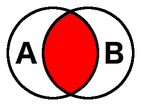

# Expressions

## Simple Expressions

Simple expressions are a single primary expression, unary operation, or binary
operation. An expression is not a complete OAL statement, but is evaluated as
part of a full OAL statement such as `assign`, `if`, `where`, etc.

### Syntax
```
  <primary expression>
  <unary operator> <primary expression>
  <primary expression> <binary operator> <primary expression>
```

`<primary expression>` is a local variable reference, an activity invocation
(function, operation, message, bridge), a constant value reference, an
enumerator reference, a parameter access, an instance attribute access, a
structure member access, or a literal value.

`<unary operator>` is any unary operator appropriate for the data type to which
the expression evaluates. See below for the full list of unary operators for
each type.

`<binary operator>` is any binary operator appropriate for the data types to
which the expression evaluates. See below for the full list of binary operators
for each type.

### Examples
```
  not ( CHK::get_status() )
  x + y
  name == "Jeff"
  "Bridge" + "Point"
  cust1.age - cust2.age
```

## Compound expressions

Compound expressions can be used to combine simple expressions, allowing for
multiple tests and more complex assignment arithmetic.

### Syntax
```
  <unary operator> <expression>
  <expression> <binary operator> <expression>
  ( <expression> )
```

`<expression>` is a simple or compound expression

`<unary operator>` see above

`<binary operator>` see above

### Examples
```
  // examples of compound expressions:
  not (arm.available and servo.on)
  2 * (x + y) + TIM::timer_remaining_time(timer_inst_ref:timer_1)
  (a + b) / (c - d)

  // examples of OAL statements using
  // compound expressions:
  if ((i == 1) AND (name == "Doug"))
    x = 0.5 * (y + z);
  end if;

  x = x * ((x + 1) / (x + 2));
```

### Operator precedence

The analyst can depend on the following rules regarding the order of evaluation
of compound expressions:  
* Parentheses can be used to override all other ordering rules.  
* All sub expressions with operators of equal precedence are evaluated from left
  to right, starting with the operators of highest precedence. This is repeated
  until the compound expression has been completely evaluated.  
* A short-circuit with regard to compound expressions means that an expression
  can be fully evaluated based upon the value of one of its sub expressions.
  Whether or not short-circuiting occurs depends entirely on the implementation
  of the software architecture or the simulator being used. The analyst should
  therefore avoid writing OAL that depends on short-circuiting of expressions.  

The following precedence table specifies the evaluation order in OAL ordered
from highest precedence (tightest binding) to lowest precedence (loosest
binding).

| Operator(s)                   | Description                      |
|-------------------------------|----------------------------------|
| cardinality, empty, not_empty | instance reference and set tests |
| not , -                       | negation                         |
| \* , / , % , & , ^            | multiplicative operation         |
| + , - , &#124;                | additive operation               |
| == , != , < , > , <= , >=     | comparison operation             |
| and                           | logical conjunction              |
| or                            | logical disjunction              |

## Arithmetic expressions

Arithmetic expressions are defined for real and integer data types only. These
data types may be mixed for any given expression.

| Operator | Description                     |
|----------|---------------------------------|
| *        | multiplication                  |
| /        | division                        |
| %        | remainder                       |
| +        | addition                        |
| -        | subtraction/additive inverse    |

### Notes

* If any sub expression in an arithmetic expression is real, the expression will
evaluate to a data type of real.  
* Division of two integers results in the integer division result (truncated)
  and will not produce a real value.  
* When `-` is used as a unary operation, it evaluates to the additive inverse of
  the operand.  

### Examples
```
  -27
  2 + 2
  (x + y) / 2
  0.707 * voltage
  (plane.offset + ALT::get_altitude())
```

## Boolean expressions

A boolean expression is any expression that evaluates to either a `true` or
`false` value. Boolean expressions are often used for comparison in statements
like `if` and `while`, and also in `where` clauses. Although boolean expressions
usually contain other expression types (such as arithmetic or string
expressions), they can also be used to compare time values, instance references,
instance set references, and unique IDs. There is also one unary operator,
`not`, which can be used to logically negate a boolean expression.

| Operator              | Description                      | Valid operand types                        |
|-----------------------|----------------------------------|--------------------------------------------|
| ==                    | equality                         | any                                        |
| !=                    | inequality                       | any                                        |
| <                     | less than                        | integer, real, date, timestamp, string     |
| >                     | greater than                     | integer, real, date, timestamp, string     |
| <=                    | less than or equal to            | integer, real, date, timestamp, string     |
| >=                    | greater than or equal to         | integer, real, date, timestamp, string     |
| and                   | logical conjunction              | boolean                                    |
| or                    | logical disjunction              | boolean                                    |
| not                   | boolean negation                 | boolean                                    |
| empty<sup>1</sup>     | instance reference/set empty     | instance reference, instance reference set |
| not_empty<sup>1</sup> | instance reference/set not empty | instance reference, instance reference set |

<sup>1</sup> see section ["Additional unary operators"](#additional_unary_operators)

### Note

* Both operands of equality and comparison operators must be of the same type
  or of a user defined type based on the same core type, except for numeric
  types.  Integers and reals can be mixed in equality and comparison
  operations. See section ["Data Type Strength"](../HTML/bpalref.book-3.htm#data-type-strength)
  for more information.

### Examples
```
  x == 1
  id != "abc"
  CTL::error() or flag
  (account.balance == 0.00) and ((TIM::get_current_time() - last_pay_time)
    >= max_wait)
```

## String expressions

A string expression is any expression that evaluates to a string value. String
expressions can be either a simple string or a concatenation of one or more
simple strings.

| Operator | Description          |
|----------|----------------------|
| +        | string concatenation |

### Examples
```
  "Hello, world!"
  "Executable" + "-" + "UML"
  cust.first_name + " " + cust.last_name
  CHS::get_date_string(date:TIM::current_date())
```

## Instance set expressions

An instance set expression is any expression that evaluates to an instance set
value. Instance set expressions are used for set arithmetic. Instance reference
and instance reference set types are valid operands for instance set
expressions.  During evaluation, an operand of instance reference type is
considered to be an instance set containing exactly one instance.

| Operator(s) | Description              |
|-------------|--------------------------|
| &#124; , +  | set union                |
| &           | set intersection         |
| -           | set difference           |
| ^           | set symmetric difference |

### Set arithmetic definitions

* A **set** is a collection of elements in which there are no duplicates.
* The **union** of sets A and B (`A | B` or `A + B`) is
  the set of all elements that are contained in either A or B (or both). Note
  that the result is still a set (no duplicates) even if an element is in both A
  and B. Union is commutative, meaning `A | B == B | A`.  

* The **intersection** of sets A and B (`A & B`) is the set of all elements that
  are contained in both A and B. Note again that the result is still a set (no
  duplicates). Intersection is also commutative, meaning `A & B == B & A`.  

* The **difference** (subtraction) of sets A and B (`A - B`) is the set of all
  elements that are in set A and _not_ in set B. Subtraction is _not_
  commutative meaning `A - B != B - A`.  

* The **symmetric difference** (disjunctive union/disunion) of sets A and B (`A
  ^ B`) is the set of all elements that are in set A or in set B but _not_ both.
  Symmetric difference is also commutative, meaning `A ^ B == B ^ A`.  


### Note

* To use set expressions, the operand types must be published using the "Publish
  References" context menu tool. See the [BridgePoint Context Menu
  Tools](../../UserInterface/BridgePointContextMenuTools/BridgePointContextMenuTools.html#shared-context-menu-entries)
  for more information.

### Examples
```
  select many animals from instances of ANIMAL;
  select many dogs related by animals->DOG[R1]->ANIMAL[R1];
  select many cats related by animals->CAT[R1]->ANIMAL[R1];
  select many fish related by animals->FISH[R1]->ANIMAL[R1];
  dogs_and_cats = dogs | cats;
  not_fish = animals - fish;
```

## Where expressions

A where expression is a special type of boolean expression used in a `select`
statement. The instance handle `selected` is valid only within the where
expression. The `selected` keyword should be used as an instance reference to
access the instances of the given set for the `select` statement containing the
`where` expression. The `where` expression must evaluate to a boolean value.

### Examples
```
  select any firstname from instances of EMP where selected.name == "Bob";
  select many accounts from instances of ACC where (selected.status == "Ok") and
    (selected.balance > (min_bal + 200));


  // Use where clause to find a particular probe.
  select any probe from instances of SP
         where selected.probe_ID == param.probe_id;
  generate SP3:probe_in_position to probe;
```

## Constant and enumerator values

The analyst can define enumerated data types and symbolic constants to be used
in action language. Enumerator values may only be used in expressions where the
enumerated type is expected (assignment statement, equality expression, etc.).
Symbolic constants may only be defined for the core types `integer`, `real`,
`string`, `boolean`. A symbolic constant reference may be used in any
expression that is compatible with the type which is assigned to it.

### Syntax
```
  <enumerated data type name>::<enumerator name>
  <constant specification name>::<symbolic constant name>
  <symbolic constant name>
```

### Note

* If a symbolic constant value is accessed without being scoped by the name of
  the constant specification, the constant name must be unique in the global
  scope.

### Examples
```
  day = DayOfWeek::MONDAY;
  mole = AVOGADROS_NUMBER;
  circumference = 2 * Math::PI * r;
```

## Literal expressions

In many of the examples, literals have been used as parts of expressions. While
this serves well for the purposes of illustration, it should be noted that most
analysis models require minimal use of literals since such data is more commonly
stored as attributes of specification classes, or symbolic constants.

| Type    | Examples              |
|---------|-----------------------|
| integer | 1, 42, -127, etc.     |
| real    | 1.0, 4.5, -56.0, etc. |
| string  | "string"              |
| boolean | true, false           |


### Notes

* Literals may be defined for the above data types only.
* Based arithmetic literals and scientific notation are not supported.

## Additional unary operators <a id="additional_unary_operators"></a>

Three operators have been provided to allow the analyst to determine the size of
an instance reference set or whether or not an instance reference is defined.
These operations may be performed anywhere an expression may be used.

| Operator    | Description                      | Valid operand types                        | Evaluation type |
|-------------|----------------------------------|--------------------------------------------|-----------------|
| empty       | instance reference/set empty     | instance reference, instance reference set | boolean         |
| not_empty   | instance reference/set not empty | instance reference, instance reference set | boolean         |
| cardinality | instance reference set length    | instance reference set                     | integer         |

### Examples
```
  select one d_inst related by self->D[R1];
  if (not_empty d_inst)
    // Statements here protected against access to empty d_inst.
  end if;
```
