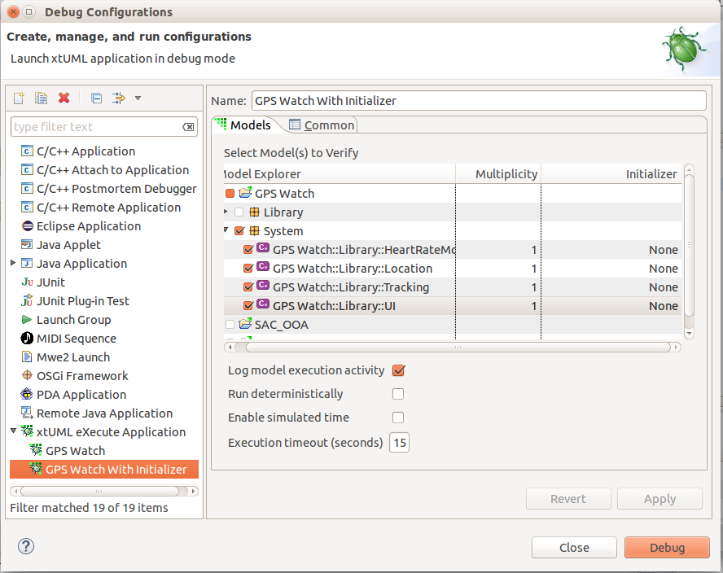

Command Line Interface
========================

The Command Line Interface (CLI) provides a mechanism to automate the execution and translation 
of xtUML projects. The CLI supports Import, Build and Execute tasks using the following command 
structure:   

```
CLI <Build | Import | Execute | Merge> <Argument List>
```  
   
where ```<Argument List>``` depends on the task. Further details on the options available for each 
CLI task can be found by entering

```
CLI <Build | Import | Execute | Merge> -help
```
 
Examples demonstrating the expected usage of the CLI are included in the BridgePoint and xtUML Editor 
installation, and can be found in the folder <Installation root>/eclipse. Note, that the examples are 
specific to the host operating system with CLI.bat intended for Windows and CLI.sh intended for Linux.   

 
Preparing a Project to be Used With CLI
------------
Prior to invoking the CLI, the target project and associated workspace will require some setup. Initially, 
the CLI script must be customized as follows:

1. Copy the CLI script into the project workspace
2. Modify the script to assign the WORKSPACE variable to the correct path
     
For each target project, launch and build configurations are required under the following circumstances:

1. For projects using the Build task,  a CDT build configuration must exist for each name requested by option ```-buildConfig```
2. For projects using the Execute task, a launch configuration must exist for each name requested by option ```-launch``` and each configuration must identify at least one Initializer (an interface operation, interface signal or state machine event). It is recommended that the "Execution timeout (seconds)" selection be set to a value great than 0 (no termination) which will force execution to terminate with a timeout error message if the execution time exceeds this limit.
   
   
   
    
Building a Project Using the CLI
------------
The Build task is used to translate an xtUML model using the project’s selected model compiler. The task 
is initiated by

```
CLI  Build  <Argument List>
```
where ```<Argument List>``` can contain any of the following options

| Parameter                 | Description                          |
|---------------------------|--------------------------------------|
| -project &lt;name&gt;     | The name of the project to be built  |
| -buildConfig &lt;name&gt; | The name of the CDT build configuration to be used. If omitted then the current Active configuration is used |
| -prebuildOnly             | Only the BridgePoint Model Compiler pre-builder will be executed |
| -doNotParse               | Do not parse the model during this build process.  Only applies if -prebuildOnly is used. |  
| -cleanCLI                 | Perform a clean build of the project |
| -debugCLI                 | Launch a workbench and leave it open after executing |
| -help                     | Displays usage information |

 
Importing a Project Using the CLI
------------
The Import task is used to add the named project to the current workspace. The task is initiated by   

```
CLI  Import  <Argument List>
```  
where ```<Argument List>``` can contain any of the following options

| Parameter                   | Description                          |
|-----------------------------|--------------------------------------|
| -project &lt;directory&gt;  | The fully qualified path of the project to be Imported  |
| -deleteExisting             | If a project with the same name exists in the workspace, this option will delete it before importing the named project. |
| -file &lt;file&gt;          | The fully qualified path of the xtUML file to import. |
| -targetProject &lt;name&gt; | This argument is used together with "-file". Specify the name of project to import into.  The project must already exist in the workspace. If this is not specified, the project name will be assumed to be the name (minus extension) of the file being imported. |
| -help                       | Displays usage information |
   
    
Executing a Project Using the CLI
------------
The Execute task is used to run an xtUML model using BridgePoint’s xtUML Debugging perspective. The 
task is initiated by

```
CLI  Execute  <Argument List>
```
where ```<Argument List>``` can contain any of the following options
   
| Parameter             | Description                          |
|-----------------------|--------------------------------------|
| -launch &lt;name&gt;  | The name of the launch configuration to execute |
| -debugCLI             | Launch a workbench and leave it open after executing the command |
| -help                 | Displays usage information |
   
   
Merging Changes From a Remote Version into the Local Project Using the CLI
------------
The Merge task is used to produce an xtUML model file containing the merged resultant from two 
xtUML model files that are derived from a common ancestor. The task is initiated by

```
CLI  Merge  <Argument List>
```   
where ```<Argument List>``` must contain either ```-help``` or the other arguments
   
| Parameter                  | Description                          |
|----------------------------|--------------------------------------|
| -rightFile &lt;file&gt;    | The name of the remote file to be used in the comparison.| 
| -leftFile  &lt;file&gt;    | The name of the local file to be used in the comparison.|
| -ancestorFile &lt;file&gt; | The name of the common ancestor to the rightFile and the leftFile.|
| -outputFile &lt;file&gt;   | The name of the file to hold the result produced when the leftFile is merged with the rightFile.|
| -help                      | Displays usage information |
   
Note that the Merge task will fail and no output file generated, if conflicts exist between the 
leftFile and the rightFile. Also, an absolute path must be specified for the left, right, ancestor 
and output files.
      
   
Suggestions when Troubleshooting CLI Problems
------------
When problems involving scripts that interact with CLI arise, consider these suggestions while 
investigating the problem

1. Interactively, repeat the scripted steps inside the tool GUI. The information contained in the console window will assist in isolating the problem and will confirm whether the issue relates to the CLI or other aspects of the scripted process.
2. Once confirmed that the issue is most likely a CLI problem, modify the ```eclipsec``` invocation inside the CLI script to add ```-debug -console -consoleLog``` to the command just before ```-application``` and re-run the script. These additional settings will cause extra detail to be added to the console output.
3. If the problem continues to be elusive, add ```-debugCLI``` to interesting CLI commands.  The ```-debugCLI``` option is analogous to a breakpoint at the end of the CLI command that will leave the eclipse workbench open for further interactive probing.
    
The combination of these four suggestions is often sufficient to isolate and correct CLI problems.
   
    
A CLI Example for the GPS Watch
------------
In this example, the GPS Watch project is imported from the workspace at ```c:/Projects/BridgePoint/temp``` into 
the local workspace. Once imported, the project is built using the Debug configuration and then executed 
using the ```GPS_Watch_test``` debug configuration. To perform this sequence, a simple script containing 
the following CLI commands is sufficient:
   
``` 
CLI.bat Import -deleteExisting -project “C:/Projects/BridgePoint/temp/GPS_Watch”

CLI.bat Build -project GPS_Watch -buildConfig Debug -cleanCLI

CLI.bat Execute -launch “GPS Watch With Initializer”
```    
 
If the GPS watch is modified in two branches, GPS1 and GPS2, then a merged model.xtuml file can be 
produced from the CLI command

```
CLI.bat Merge -leftFile c:\workspace\GPS1\model.xtuml ^

 -rightFile c:\workspace\GPS2\model.xtuml ^

 -ancestorFile C:\MentorGraphics\BridgePoint\workspace\GPS_Watch\model.xtuml

 -output\File c:\workspace\GPS_merge\model.xtuml
```    
  
  