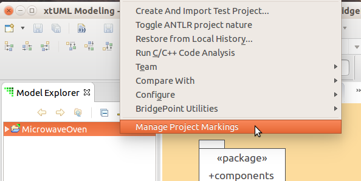
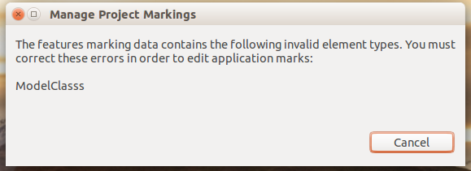

Marking Editor
========================

Application marks are used to control and customize the model translation 
process.  They allow the modeler to provide values for pre-defined features
of the model compiler.  The name ``mark'' comes from the visualization of using 
a highlighter pen to mark each element that has a particular property.   

The MASL model compiler takes this input in the form of ```pragma``` statements
associated with application model element.  The marks created using this marking
editor are output as ```pragma```s when the modeler runs the ```Export MASL```
tool.      

The marking editor provides a user interface for the MASL marking process.  It
uses selection fields to minimize the possibility of user-induced typing errors
in the marking process.   

This document uses the following vocabulary:  
* __Element Type__ - xtUML metamodel class name (e.g. Model Class, Component, Attribute)  
* __Element__ - an application instance of a given element type (e.g. in the GPS Watch
 there are "Tracking" and "UI" components)   
* __Feature__ - a feature is defined by a model compiler architect independent of
  all application models.  During model translation it may provide input to the 
  model compiler about some aspect of the application model or it may provide
  dynamic input (flag) to the model compiler itself.  
* __Mark__ - A mark is the user-created specification of a value for a feature tied
  to a specific model element.  
  
## User Interface
The marking editor dialog is launched via the context-menu of an xtUML Project (Figure 1). 
Simply right-click on the project then choose ```Manage Project Markings```.  
   
   
__Figure 1__   
    
This action will open the ```Manage Project Markings``` dialog (Figure 2).  This 
dialog provides selection lists and a table editor to enter values.   
   
  
__Figure 2__   
   
The modeler will first select the type of element to mark, such as a 
```Model Class``` or ```Component```.  

Once the element type is selected, the ```Model Element``` list is populated with 
all the instances of that element type in the current model.  The elements are 
displayed using their path inside the model to allow the user to uniquely 
identify the desired model element.   
   
After the model element is selected, the table is populated with the available
features that are valid to mark for that element.  The value field is populated 
with any marks previously defined by the modeler.  The value field is editable,
allowing the user to change or remove values for any mark.  
* Values are stored and passed to the model compiler exactly as written.  It is 
up to the modeler to add quotes where necessary, even providing empty quoted
strings ```""```.   
* Value fields that are blank are considered to be unmarked and are removed from
the marking data and not passed downstream to the model compiler.   
* It is legal to put comma characters in value fields and to mix quoted and non-
quoted data in the value list.  For example: ```2, "domain", "trigger"```   
   
The dialog provides ```OK``` and ```Cancel``` buttons.  If the user clicks ```Cancel``` 
then no data changes are persisted.  If the user clicks ```OK```, the data is persisted.      
   
## Marking Data Files   
The marking data is stored in two files: ```features.mark``` and ```application.mark```. 
Both files live in the project's ```gen/``` folder, which can be found by opening the
Navigator view in the xtUML Modeling perspective or by opening the C/C++ perspective.  

### File: features.mark   
A file called ```features.mark``` (a human-readable text file) is created by the 
model compiler architect and stored in the project's ```gen/```  folder.  This 
file indicates which features are valid for which OOA of OOA elements (Figure 3).
    
```
# Features that can be set on classes
Model Class,id
Model Class,soa_remote
Model Class,bar
Model Class,baz

# Other features  
Component,id
Attribute,id
Component,foo
Attribute,foo
Attribute,soa_remote
```
__Figure 3__  
  
 The file contains pairs, one per line (Figure 4).  
   
```
<xtUML element type>,<feature name>
```
__Figure 4__  
   
This file is not modified by the marking editor.  It is modified by hand by the 
model compiler architect.   The xtUML element type matches the name of a class in 
the xtUML metamodel.  Table 1 provides mappings from MASL markable elements to 
xtUML element types for use in creating this marking file for a model converted 
from MASL:  

| MASL Markable Element | xtUML Element Type                   |
|-----------------------|--------------------------------------|
|project                | Component                            |
|(project-)domain       | Component Reference                  |
|domain                 | Component                            |
|(domain-)terminator    | Port                                 |
|(project-)terminator   | Provision                            |
|(project terminator service) routine | Provided Operation     |
|object                 | Model Class                          |
|(domain function or service) routine | Function               |
|(terminator function or service) routine | Required Operation |
|operation              | Operation                            |
|state                  | State Machine State                  |
|attribute              | Attribute                            |
|transitiontable        | State Machine                        |
|event                  | State Machine Event                  |
|type                   | User Data Type                       |
|member                 | not yet mapped                       |
|exception              | Exception                            |
|identifier             | not yet mapped                       |
|regularrel             | Association                          |
|associative            | Association                          |
|subsuper               | Association                          |   
__Table 1__   

Notes:
* This file is allowed to have blank lines    
* This file is allowed to have lines that begin with ```#``` to denote a comment
line that should be ignored  
* Comma characters are not allowed in feature names  
  
If the model compiler architect has entered an invalid xtUML element type name, the
marking editor will catch this and require it to be fixed before proceeding (Figure 5).  
  
  
__Figure 5__   
    
### File: application.mark   
The application-specific marking data is stored in the project in the ```gen/application.mark```,
a human-readable text file.  This file maps the unique path to the application model 
instance with the feature/value pair set by the user.  An example for the Microwave Oven
project is provided in Figure 6.      
```
components::MicrowaveOven::Microwave Oven::Turntable,id,Model Class,2
components::MicrowaveOven::Microwave Oven::Turntable,soa_remote,Model Class,"aj", 0,    "keith", 2
components::MicrowaveOven::Microwave Oven::Turntable,bar,Model Class,doit
components::MicrowaveOven::Microwave Oven::Turntable,baz,Model Class,ajb
components::MicrowaveOven::Microwave Oven::Door,id,Model Class,1
components::MicrowaveOven::Microwave Oven::Door,bar,Model Class,ddd
components::MicrowaveOven::Microwave Oven::Door,baz,Model Class,"yepperdo"
components::MicrowaveOven::Microwave Oven::Door,soa_remote,Model Class,""
components::MicrowaveOven,id,Component,9
components::MicrowaveOven,foo,Component,fooval
components::MicrowaveOven::Microwave Oven::Magnetron Tube,soa_remote,Model Class,""
components::MicrowaveOven::Microwave Oven::Magnetron Tube,baz,Model Class,"999"
components::MicrowaveOven::Microwave Oven::Magnetron Tube,bar,Model Class,ddd
components::MicrowaveOven::Microwave Oven::Internal Light,id,Model Class,4
components::MicrowaveOven::Microwave Oven::Oven,id,Model Class,33
components::MicrowaveOven::Microwave Oven::Oven,bar,Model Class,barov
```   
__Figure 6__  
  
The file contains four columns, one per line (Figure 7).  
```
<model instance path>,<feature name>,<xtUML element type>,<value>
```   
__Figure 7__  

There are a few specific things to note about this file:  
* Comments __are not__ supported  
* Marks are not automatically updated if elements are renamed or removed.  This 
means that if the modeler moves, deletes, or renames an element, he or she must either
remark the new element in this file and delete the old element, or edit the new
path data into this file by hand on the old entries.  Marks that do not match
any instances in the model are simply ignored by the ```Export MASL``` process and
are not passed downstream.  Therefore, they do not hurt anything if left in place.
The export process will provide warnings for unused marks.        
    
This file is loaded and persisted in an ordered way to minimize file differences 
when data is added and removed with the editor.  The primary sorting key is the 
model instance path.  Entries with the same path are persisted together.  Within 
the same path entries are persisted back out in the order in which they were read 
in.  Thus, if a user were to edit the file with a text editor and add a new line 
at the end as in Figure 8:
```
components::MicrowaveOven::Microwave Oven::Internal Light,soa_remote,Model Class,""
```
__Figure 8__  
  
    
then when the file is written out, the value is moved up (Figure 9):  
```
...
components::MicrowaveOven::Microwave Oven::Magnetron Tube,bar,Model Class,ddd
components::MicrowaveOven::Microwave Oven::Internal Light,id,Model Class,4
components::MicrowaveOven::Microwave Oven::Internal Light,soa_remote,Model Class,""
components::MicrowaveOven::Microwave Oven::Oven,id,Model Class,33
...
```   
__Figure 9__  
  
When features are given values, they are added after other features with the same 
path.  Therefore, if the user uses the marking editor to set value "1000" to the 
```baz``` feature and change ```id``` to 5, the output will be as in Figure 10:  
```
...
components::MicrowaveOven::Microwave Oven::Magnetron Tube,bar,Model Class,ddd
components::MicrowaveOven::Microwave Oven::Internal Light,id,Model Class,5
components::MicrowaveOven::Microwave Oven::Internal Light,soa_remote,Model Class,""
components::MicrowaveOven::Microwave Oven::Internal Light,baz,Model Class,"1000"
components::MicrowaveOven::Microwave Oven::Oven,id,Model Class,33
...
```  
__Figure 10__  

  