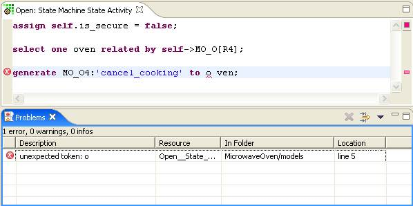

Activity Editor
===============

The Activity Editor is used to edit the action language (called activities in
UML 2.0) for those model elements that can define them: functions, bridge
operations, instance-based and class-based operations, derived attributes, and
state actions. The Activity Editor is a syntactically-aware editor that assists
the user in writing the applications actions.

When an activity is written, it is checked for both syntax errors (missing
semi-colons and malformed keywords) and semantic errors (references to unknown
classes or events in the model). As can be seen in the figure above, the two
errors result in several indicators inside the editor and entries in the
Problems view.

The small red circle with an X in the left-hand vertical ruler points to the
line that contains the error. This annotation in the editor corresponds to the
error as it is listed in the Problems view. The Problems view shows a
description of the error along with its location. Double-clicking on the error
in the Problems view positions the cursor on the activity in the editor. If the
activity is not currently being edited, the Activity Editor is brought up.

The right-hand vertical ruler shows an overview of the annotations for the text
currently being displayed in the editor. The red ones indicate the position of
errors in the activities. Clicking on the annotation positions the cursor to
the activity containing the error.

Each of the errors is also underlined with a red squiggly line to indicate the
exact position of the error on the line.

### Declaration searching

The Activity Editor supports searching for the declarations of certain elements
referenced from the activity. To search for a declaration, right click, then
select "Open Declaration". For references to structural elements, the Model
Explorer and Canvas views will be activated to focus on the element. For local
variable references, the first usage of the variable in the editor will be
highlighted. Some element types are not supported by the "Open Declaration"
action. If this menu option is selected when the cursor is on an unsupported
element, no action will be taken.

### Completion assistance

The Activity Editor supports smart completion assistance in many OAL constructs.
To activate, type 'Ctl+Space'. Completion assistance can also be auto activated
on user defined character sequences. For more information about completion
assistance configuration see the [Content Assist Preferences
documentation](../../Preferences/HTML/ContentAssist.html)
