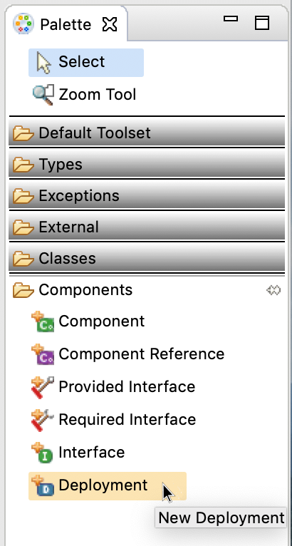
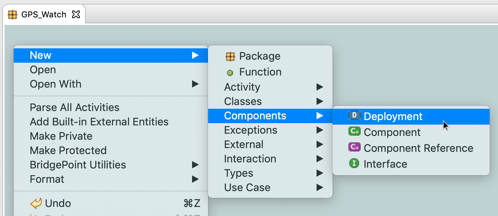
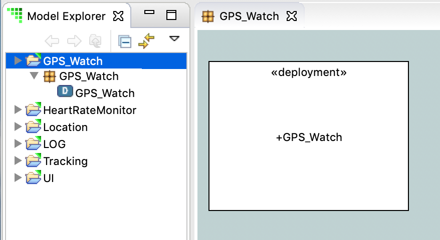
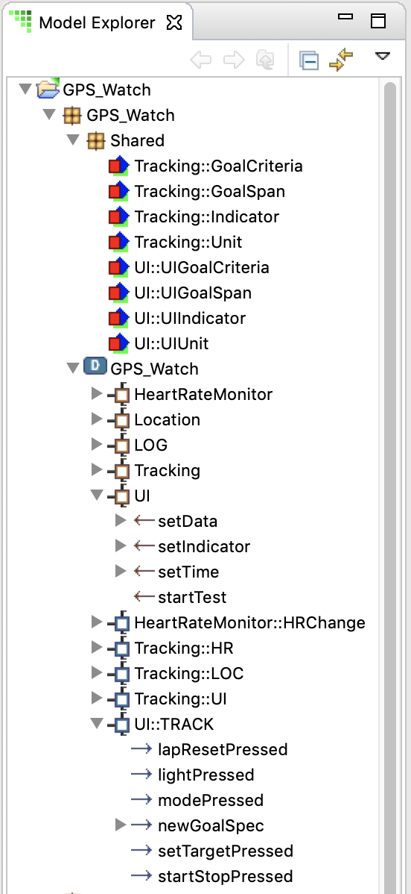
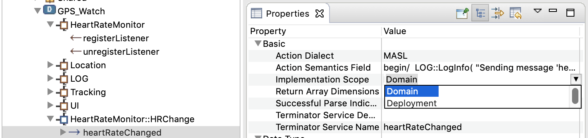
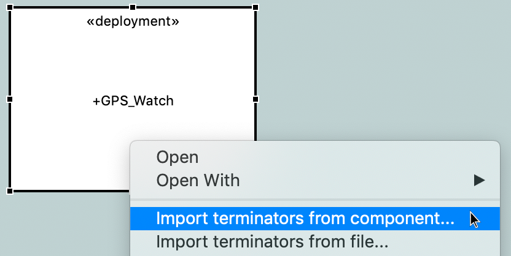
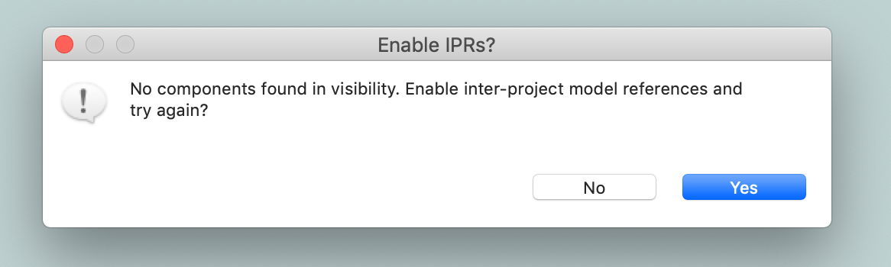
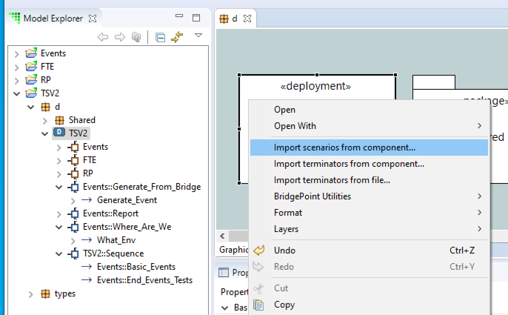
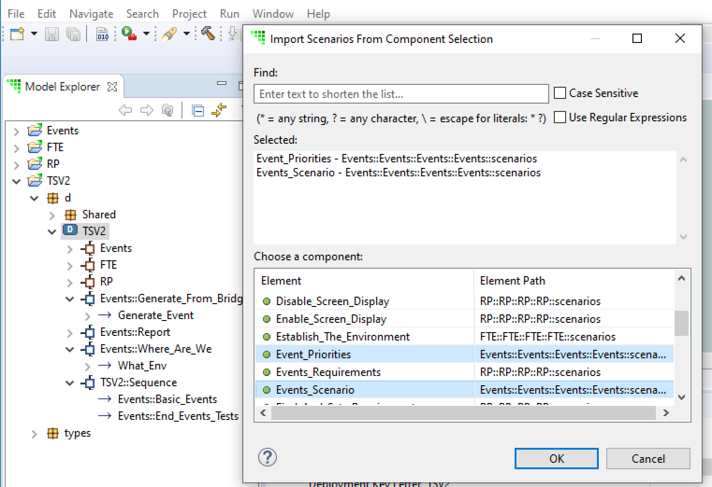
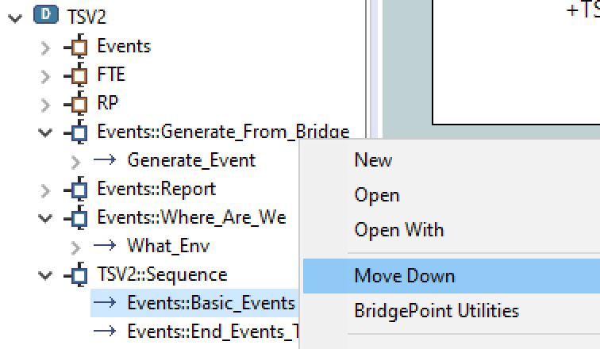

=  Deployments
:icons: font
:sectnums:
:toc:

== Introduction

In an xtUML model, components (also known as "domains") define a cohesive block of
functionality whose internal behavior may be defined by classes and state machines
or realized code in a target language.  Components communicate with one another 
via interfaces that define messages that the component uses to access behavior from
other components or to declare behavior that the component itself provides for 
other components to use.  This process of connecting components together is called
"wiring" or "bridging".

BridgePoint xtUML provides two mechanisms to accomplish this domain bridging. OAL 
users have historically used the direct and graphical wiring together of interfaces 
on component references. That approach does not use deployments as described here.

Deployments were added to accomplish bridging in a way that is more natural to modelers 
using MASL/ASL. Deployments reference domain components by name rather than by
direct reference and graphical interconnections. This allows deployments to be edited 
without requiring all associated domain projects to be in the workspace at the same 
time.  Deployments are therefore separated and independent from the domain sources.
Component reference wiring, on the other hand, _does_ require the associated domain 
projects to be present in the workspace.

The choice of which method to use is based on the needs of the user and choice of 
model compiler the user is running to translate their model. The remainder of 
this document focuses on the creation and use of deployments themselves.  Readers 
are encouraged to read the documentation link:../../../SystemModeling/HTML/SystemModeling.htm[System-Level Modeling with Components] 
and link:../../../../MASL/MASLConversionGuide/MASLConversionGuide.html[MASL Modeling and Conversion Guide].

== Creating deployments

.Deployment via Palette
 

Deployments are created like other model elements, via the Palette (Figure 1) or via 
the context menu on canvas or Model Explorer (Figure 2).  Both options operate identically; 
neither method of creation is better than the other.

.Deployment via "New" menu

Once the deployment is created, it will display on the canvas and in the Model Explorer
(Figure 3). When creating a deployment, it is recommended to create a new xtUML project 
to hold only the deployment.   

.Deployment graphic on canvas and in Model Explorer
 

Unlike packages and components, deployments offer no additional visualization on
the canvas.  The details of deployments are accessed and manipulated via the Model 
Explorer view.

== Editing deployments

As mentioned previously, deployments are designed to maintain a separation and 
independence from the domain sources. At the same time, deployments provide the
ability to be refreshed from the domain sources. To preserve this loose coupling 
between the deployment and its source, but also ensure that the deployment stays
reasonably in sync with the source, deployments are designed so that very few
things are editable by the user.

In the model of a deployment, a user may edit:

* The name of the deployment
* Description fields on deployments, terminators, terminator services, and
  terminator service parameters
* Action semantics (action language) of terminator services
* Parse indicator of terminator services
* Dialect of terminator services
* Implementation scope of terminator services

Everything else is not editable directly by the user, but must be edited in the
source (port message in a domain or `.int` or `.mod` file). Furthermore,
terminator services and terminator service parameters may not be deleted by the
user. Terminators and deployments may be deleted. Stale services may also be deleted
(see <<stale_services>>).

=== Provided and required terminators

.Terminators in Model Explorer

Two different types of terminators are supported by deployments (Figure 4). Provided
terminators represent all of the public services (inbound API) of a particular 
domain. These are named with the same name as the domain and appear brown in the 
Model Explorer view. Services on provided terminators are automatically assigned the 
"None" dialect. For MASL/ASL users, the dialect should always be "None" for provided services. 

Required terminators represent the terminators (outbound API) of a domain. They 
are named with the name of the domain followed by `::` followed by the name of the 
terminator itself as in: `Tracking::UI` and appear blue in the model explorer. 
Services on required terminators are automatically assigned the dialect of the 
source service or the workspace default dialect when necessary. 

=== Implementation scope 

In MASL/ASL modeling, users require the ability to specify that a terminator service in 
a deployment is implemented in native code. In this case, a declaration in the `.prj` 
file is necessary, but a `.tr` definition file should not be produced. Alternatively,
to indicate the domain implementation is used, a terminator service may be excluded 
from output entirely. In this case, no declaration is created in the `.prj` and no 
definition in a `.tr` are produced. Table 1 lists effects of the various combinations
of the Implementation Scope and Dialect properties of terminator services. 

.Implementation scope effect on MASL export
[options="header"]
|===
| Implementation Scope | Dialect | MASL Export Behavior                              
| Domain               | Any     | No declaration in `.prj`. No corresponding `.tr` definition file created.
| Deployment           | None    | Declaration in `.prj`. No corresponding `.tr` definition file created. 
| Deployment           | MASL    | Declaration in `.prj`. Corresponding `.tr` definition file created. 
|===

.Implementation scope effect on WASL export
[options="header"]
|===
| Implementation Scope | Dialect | WASL Export Behavior                              
| Domain               | Any     | No declaration in `.dmp`. No corresponding `.br` definition file created.
| Deployment           | None    | Declaration in `.dmp`. No corresponding `.br` definition file created. 
| Deployment           | ASL     | Declaration in `.dmp`. Corresponding `.br` definition file is created. 
|===

The property "Implementation Scope" (Figure 5) is used to control where the implementation of
a terminator service comes from. The available choices are "Domain" and "Deployment". 

.Setting Implementation Scope in Properties view

When importing terminator definitions into a deployment, the import process sets the 
Implementation Scope attribute of terminator services that are created. The default 
value is "Domain". This attribute is not modified when a re-import/refresh of a terminator 
is performed.

== Importing terminators into deployments

Terminators may be imported in one of two ways: by referring to an existing
domain component or by parsing a MASL model file (`.int` or `.mod`). The context 
menu of deployments provides access to both options (Figure 6).

.Importing terminators via context menu tools

=== Importing from a component

The `Import terminators from component...` context menu entry (CME) allows the user 
to import terminator definitions from an existing domain component. The standard 
BridgePoint element chooser (Figure 7) shows components that are visible to the deployment. 
Multiple components may be selected within the chooser.

.Importing Terminators from components
image::import_from_component_dialog.png[alt=Import terminators from component dialog,width=50%]

Once a component or components are selected to import, the action iterates over
the ports of the component. Required ports are mapped to required terminators in
the deployment where the name of the component is the domain name and the name
of the port is the terminator name. 

Provided ports are analyzed next. If the component has a single provided port or
if there are multiple provided ports but one exists with the same name as the component, 
the messages on this port are mapped to the provided terminator for that domain. If 
there are multiple provided ports but none has the same name as the component, no 
provided terminator is created.

[NOTE]
====
The xtUML Project containing the deployment may need inter-project references
(IPRs) to be turned on in order to see components in other xtUML Projects.  A dialog 
(Figure 8) is shown to prompt the user to turn on IPRs when no components are found. 

.Prompt to enable IPRs

====

After importing from a component, the projects containing the domain components need 
not remain in the workspace. 

=== Importing from MASL

The `Import terminators from file...` CME allows the user to import terminator definitions 
from a file. A file browser is shown.  Multiple `.int` or `.mod` files may 
be selected at once.

=== Importing scenarios from a component

A 'scenario' is an optional domain function that is used during the
runtime initialization of a deployment.  Scenarios are defined and located
in domain components in packages named "scenarios".  Scenarios can be
ordered into a cohesive 'sequence' representing the inititialization
ordering of the configured deployment.  A sequence of scenarios can be
produced in a deployment by importing scenarios from domain components in
the workspace and ordering them within the deployment sequence terminator.

.Import scenarios from components

If scenarios exist in domain components in the workspace, a context menu
entry appears on the Deployment context menu.

Initiating the 'Import scenarios from component' menu triggers to pop-up
of a scenario chooser.  A table is presented that lists scenarios on the
left and their associated model paths on the right.  Multiple scenarios
can be chosen using the standard mouse select and multi-select gestures.

.Selecting scenarios

.Sequence terminator with scenarios

Once the scenarios have been chosen with the scenario chooser, a sequence
is created as a specialized terminator in the deployment.  This terminator
is named following the pattern '<deployment name>::Sequence'.  The
scenarios in the sequence can be arranged in the desired order by dragging
and dropping the scenarios or by using the
'Move Up' and 'Move Down' context menu entries.  The WASL Exporter
preserves this ordering of scenarios in the exported files so that the
downstream architecture may use them to sequence runtime initialization.

=== Type references

Terminator services and service parameters may refer to types which are not
xtUML core types. In order to maintain loose coupling between the source and the
deployment itself, new types must be created if they are not found within the
deployment project. The standard way type references are created for MASL is by
creating a new xtUML user data type and setting its core type to be `MASLtype`. Public
domain types referenced by project terminators must be qualified with the name
of the domain as in `UI::GoalCriteria`.

The import mechanism searches for these types in a package called "Shared"
adjacent to the deployment itself. If they are not found, they are created.
`MASLtype` is expected to be in a package called "types" at the top level of
the model and is created if it is not found in that location.

=== Xtext MASL dependencies

Dependencies on domain services and types can be defined in the `.dependencies`
file or by using the Dependencies editor from the "Project Preferences" CME. These
dependencies are used by the Xtext MASL editor to allow references to external
elements to be resolved in MASL action language. As a convenience feature, these
dependencies are automatically added to the `.dependencies` file when a provided
terminator is imported. With this automatic process, a modeler can immediately
start making invocations to provided terminator services from action language
once they are imported.

For terminators imported from a MASL file, an absolute path reference to the
selected file is added to the `.dependencies` file.

For terminators imported from a component, a dependency on a file named
`<Component_Name>.int` adjacent to the component source (`.xtuml`) file is added
to the `.dependencies` file. This new dependency uses the `WORKSPACE_LOC`
substitution variable, so it is not an absolute filesystem path. This location
is the location where the `.int` file for the referenced domain will be
generated by the MASL refresher.

== Refreshing terminators from source material

Terminators inside a deployment are refreshed when a user re-imports from a 
component or domain interface file. Since the signature of a service is the 
identifying key, it can be difficult to identify which service must be updated if 
the signature changes. The approach of BridgePoint is conservative, trying to make 
good decisions when safe while avoiding any loss of data. 

[[stale_services]]
=== Stale services 

In order to prevent action language from ever being wrongfully deleted, the
merge/refresh algorithm never deletes services but rather marks them as "stale"
if it thinks they may need to be removed. In the case of stale service being
created, the modeler must determine whether the service should be deleted or
whether the action language must be copied to the new version of the service.
Once the action language is copied, the stale service should be deleted.

TIP: Stale services will be clearly marked by the yellow triangular warning glyph. A
CME is provided on the terminator element to delete all stale services by right
clicking and selecting "Delete stale services". This CME is not available if
the terminator has no stale services. Stale services may also be deleted by
selecting the service itself and using the "Delete" CME.

== Example 

The GPS Watch (MASL) example application included with BridgePoint shows deployments
in action and was used for the screenshots shown in this document.  To import this
example into your workspace select *Help > Welcome > Quick Start > Example Application - GPS Watch (MASL)*.

The deployment is found in the `GPS_Watch` project. The other projects define the 
domain components that are connected via the bridging defined inside the deployment. 

---

This work is licensed under the Creative Commons CC0 License

---
