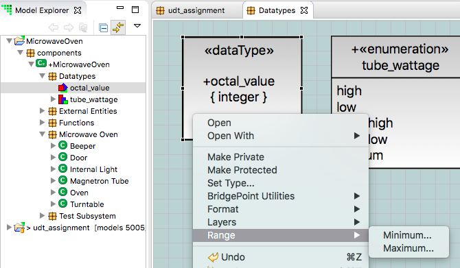
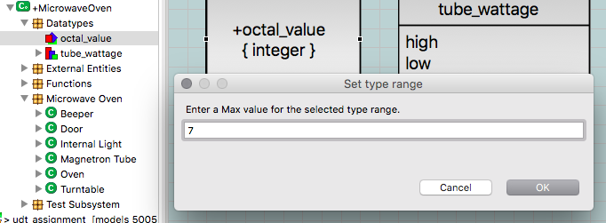

# Data Types

Data types fall into the following categories:  
* Primitive types  
* User data types  
* Structured data types  
* Enumerations  
* Constant specifications  

## Primitive types

Primitive (native) types are built-in and provided by BridgePoint.  You cannot
add to or remove from the set of primitive types.  The primitive types are:

### void

A primitive data type representing emptiness or nothingness.

### boolean

An enumeration whose only allowable values are true and false. This type is a
core data type that supports the following operators: and, or, and not.

### integer

A primitive data type whose literal values represent whole numbers, i.e., 1, 2,
3, and so on. The integer type supports the following arithmetic operations:
`+`, `-`, `*`, `/`, `%`, unary operations: `+`, `-`, and comparison operations:
`==`, `!=`, `<`, `>`, `<=`, `>=`.

### real

A primitive data type whose literal values represent real numbers, i.e., those
that can contain a fractional part as in: 1.0, 2.4, 3.14159, and so on. The real
type supports the following arithmetic operations: `+`, `-`, `*`, `/`, `%`,
unary operations: `+`, `-`, and comparison operations: `==`, `!=`, `<`, `>`,
`<=`, `>=`.

### string

A primitive data type used to define a sequence of characters. A literal string
is always enclosed in a set of double quotes, for example “abcdefg”. String
types support concatenation (+ operator) and the following lexical comparisons:
`==`, `!=`, `<`, `>`, `<=`, `>=`.

### unique_id

A primitive data type that provides an arbitrary value generated by the system
and guaranteed to be unique across all instances of the same class. Modelers
should use an arbitrary identifier (aka unique_id) when using natural
identifying attributes is either not possible or cumbersome. Only equality (`==`)
and inequality (`!=`) operators are supported.

### state&lt;State_Model&gt;

A primitive data type used internally by xtUML to keep track of the current
state of classes with state diagrams.  Variables of this type cannot be
manipulated or assigned by the user.

### same_as&lt;Base_Attribute&gt;

A primitive data type used internally by xtUML to make sure association
referential attributes use the same type on both sides of the association.
Variables of this type cannot be manipulated or assigned by the user.

### inst_ref&lt;Object&gt;

A primitive data type representing a reference to a modeled class. Variables
created via a “create object instance”, ”select one“ or “select any” statement
are of this type.  Class attributes are accessed via the “.” operator.

### inst_ref_set&lt;Object&gt;

A primitive data type representing a collection of references to a modeled
class. Variables created via a ”select many” statement are of this type.  Each
element in the collection is of type `inst_ref<Object>`.

### inst&lt;Event&gt;

A primitive data type representing a reference to a modeled event. Variables
created via a “create event instance” statement are of this type.

### inst&lt;Mapping&gt;

A primitive data type from which a user-defined type can be derived, an instance
mapping is used when an xtUML model requires access to a data structure in
another xtUML model or legacy code. Although there are no hard and set rules for
when to use an instance mapping over an instance reference mapping, the decision
usually revolves around the operations supported.

Instance mappings are commonly used when manipulating the data structure as a
whole.

All comparison operations are available for instance mappings in OAL: `==`,
`!=`, `<`, `>`, `<=`, `>=`.  However, due to their implementation-specific
nature, Verifier cannot use variables of this type in a meaningful way.

The implementation of mappings and the markings used to realize them are
provided by the BridgePoint Compiler.  See the documentation for the marking
MapDataTypeAsPointer in `<project>/gen/datatype.mark` for additional
information.

### inst_ref&lt;Mapping&gt;

A primitive data type from which a user-defined type is derived, an instance
reference mapping is used when an xtUML model requires access to a data
structure in another xtUML model or legacy code. Although there are no hard and
set rules for when to use an instance reference mapping over an instance
mapping, the decision usually revolves around the operations supported.

Instance reference mappings are commonly used when manipulating the data
structure by reference.

The equality and inequality operators are available for instance reference
mappings in OAL: `==`, `!=`.  However, due to their implementation-specific
nature, Verifier cannot use variables of this type in a meaningful way.

The implementation of mappings and the markings used to realize them are
provided by the BridgePoint Compiler.  See the documentation for the marking
MapDataTypeAsPointer in `<project>/gen/datatype.mark` for additional
information.

### component_ref

A primitive data type representing a reference to a modeled component. The
sender keyword in OAL is always of this type.  This type may be used the same
place other primitive data types are used.  It is also valid in OAL as the
target in a “send ... to `<component_ref>`” command when performing
inter-component messaging.  Class attributes, parameters, return values, and
transients may all use this type.

Variables of this type support equality and inequality operations in Verifier:
`==`, `!=`

Variables of this type are not yet supported in MC-3020.

### date

A primitive data type representing an xtUML date. Variables created via a
“TIM::create_date” or “TIM::current_date” statement are of this type. dates may
be stored in class attributes, passed as parameters and return values, and
manipulated via TIM bridge operations.

Variables of this type support equality, inequality, comparison, and assignment
operations: `==`, `!=`, `>`, `<`, `>=`, `<=`, `=`

### inst_ref&lt;Timer&gt;

A primitive data type representing a reference to a xtUML timer. Variables
created via a “TIM::timer_start” or “TIM::timer_start_recurring” statement are
of this type. Timer references may be stored in class attributes, passed as
parameters and return values, and manipulated via TIM bridge operations.

Variables of this type support equality, inequality, and assignment operations:
`==`, `!=`, `=`

### timestamp

A primitive data type representing a specific xtUML time. Variables
created via a `TIM::current_clock` statement are of this type.
timestamps may be stored in class attributes, passed as parameters and
return values.

Variables of this type support equality, inequality, comparison, and
assignment operations: `==`, `!=`, `>`, `<`, `>=`, `<=`, `=`

### MASLtype
A primitive data type created in converted MASL models. This serves as
the base type for MASL types and collections that do not directly map to
an xtUML core type (e.g. integer). MASLtype is a UDT whose core type is
string.

## User Data Types
A type based on another type. User data types (UDTs) may be based on
virtually any existing type.  User data types inherit all operators from
the primitive type and are completely compatible and interchangeable
with the base type.  UDTs allow the modeler to give a more meaningful
type name to a lower level type.

### User Data Type Ranges
Ranges are contraints used to limit the extent of
values that may be represented by a model element defined with the
constrained type.  A range is composed of a minimum and a maximum value.
Ranges are most often applied to numeric (real and integer including
enumerations) types which is the case for this capability in BridgePoint.

#### UDT Range Capabilities

- Range data is stored in the model and can be made available to downstream
model compilation tool chains.  
- A **Minimum** and/or a **Maximum** range setting is supported.  
Note that minimum and maximum range settings are _inclusive_, meaning
that the minimum value of the range is the lowest legal value to be
taken by an element linked to the ranged type.  The maximum value of
the range is the maximum legal value.  
- A **Minimum** setting, **Maximum** setting or **both** settings can be
supplied to define the range for the User Data Type.

- A context menu is available on numeric User Data Types eligible
to be constrained with Range information.  The context menu has multiple
levels ending with 3 capabilities:

  1. Set the Minimum Range value.  
  2. Set the Maximum Range value.  
  3. Clear the Range values (eliminating the Range altogether).  
     The 'Clear' menu item will show only when a Range has been
     established for the selected User Data Type.

- To view the range values for a selected User Data Type, simply
navigate the context menu to the Minimum and Maximum values as
when setting the values.  This displays the existing value setting.
Range values also are displayed on the canvas and in the Properties view.

- When changing the type of a User Data Type from integer to real or
real to integer, the range minimum and maximum values are preserved
but undergo type conversion.  When changing the type of a User Data
Type to any other type, the range is deleted.

## Structured Data Types

A structured data type (SDT) is a collection of structure members of various
types. Structure members are accessed via the “.” operator.  SDTs may be used as
return values, parameters, or class attributes. Automatic (transient) variables
become SDTs when initialized to a return value or variable whose type is an SDT.
Only the assignment operation is valid on the SDT itself.  The individual
structure members may be operated on according to the valid operations for their
respective types.

## Enumerations

A data type that can take on one of a list of uniquely named values
(enumerators) at any one time.  Variables of the enumeration type may only be
assigned one of the corresponding enumerators as a value.  Enumerators are
accessed in OAL using `<enumeration name>::<enumerator name>` with full scoping
to avoid name conflicts with transients, constants, class attributes, etc.

Variables of an enumeration type support equality, inequality, and assignment
operations: `==`, `!=`, `=`

## Constant specifications

Constant specifications are groupings of related constants. Constant
specifications may be named or unnamed. The name, if any exists, may be used to
qualify constant references in OAL in the case where there exist multiple
constants with the same name. Constant specifications are composed of zero to
many Constants. A constant has a name, type, and value. The type is restricted
to primitive types integer, real, boolean, or string and enumerated types. The
type may also be a UDT which is based on one of the types listed above or
another UDT which is based on one of the types listed above. The value is
restricted to meaningful data based on the chosen type. Integer constant values
may be specified in either decimal, hexadecimal (beginning with 0x), or binary
(beginning with 0b).
