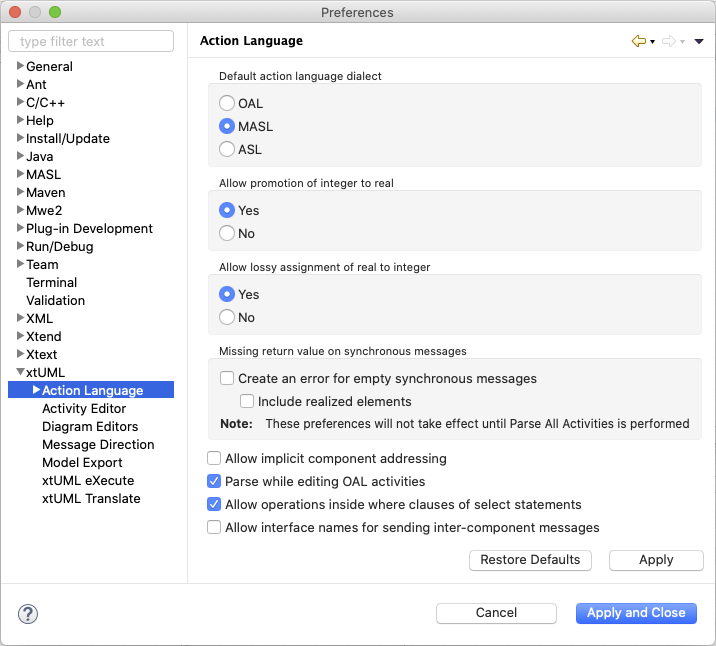

Action Language Preferences
========================

## Default action language dialect

BridgePoint supports more than one action language.  This setting controls which
action language dialect is set as the default for new model elements that contain 
action language.   

Changing this setting does not modify the dialect of any existing model elements.  

## Allow promotion of integer to real

OAL requires that the operands of a given operator are of matching type or a problem
marker is displayed.  For example, a modeler cannot compare an integer with a 
string.  

However, modelers may find it useful to have some flexibility when using operators
on numeric types.  This setting relaxes strict operand requirements and allows 
integers to be treated as reals when the other operand is a real. The result of 
the operation is a real.   

## Allow lossy assignment of real to integer

This settings exists for the same flexibility reasons as the previous setting. However,
this setting only applies to the case where a real value is being assigned into 
a element (structural or transient) of type integer.  When this setting is enabled,
BridgePoint will allow the assignment by truncating the real value down to the 
nearest integer.  

## Missing return value on synchronous messages

This preference will enable parse errors when a return value is required.  The parse
errors will be created for the following elements when they have no action language:  

* Function
* Class Operation
* Bridge Operation
* Provided Interface Operation
* Required Interface Operation  

The sub-setting controls whether or not parse errors are raised for realized elements
without return values.  

## Allow implicit component addressing

Allow (or not) the use of the `sender` keyword outside of interface activities. Enabling
this setting relies on architectural support for caching the component identity
for a given thread of control.

## Parse while editing OAL activities

Enabling this option causes the parser to run as you edit OAL.  When enabled, 
syntax errors are shown as you type.  The disadvantage is that large action bodies
may take a long time to parse.  When disabled, you must manually parse the OAL 
using the `Parse All Activities` option found in the context menu.  

A full parse is also performed by BridgePoint at the start of a xtUML Debug
launch and during the model compiler pre-build step at the beginning of a model
translation.   

## Allow operations inside where clauses of select statements  

The `where` clause of an OAL `select` statement must evaluate to a boolean 
expression.  This setting allows (or not) operation calls as part of the expression
processed during the `where` clause.   

Support for this feature at run time is architecture-dependent. Verifier does 
not support using derived attributes, operations, functions, messages, or bridges
inside the `where` clause.  
 
## Allow interface names for sending inter-component messages  

Inter-component messages defined by interfaces are best sent via uniquely named 
ports.  Enabling this option allows a modeler to write OAL `send` statements that
use (potentially non-unique) interface names.  This feature is provided for 
backwards compatibility and is not recommended for use.  

## Preference Page
    
