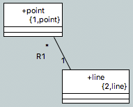
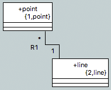
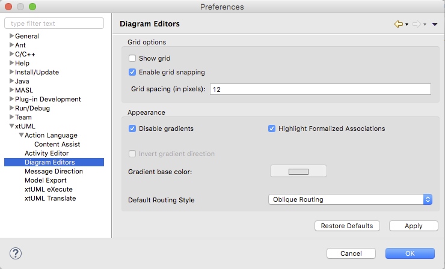

Diagram Editors Preferences
========================

## Grid Options

The `Show grid` option controls whether or not grid lines are shown on the 
diagram canvases.  The `Grid spacing` setting controls the size of the grid boxes.  

The `Enable grid snapping` option controls whether or graphical elements that are
being moved around on the canvas snap (jump to) nearby grid lines.  

## Appearance

### Disable gradients  

Draw (or not) the background of diagram canvases with a gradient fade to gray.  The
`Invert gradient direction` flips the direction of the fade when gradient backgrounds
are enabled.  The 'Gradient base color` selection allows the user to change the 
color to fade into from gray to another color.   

### Highlight formalized associations

When this option is enabled, all formalized associations are displayed in a bold
format.  Unformalized associations are display with normal weight.  This option makes
it easy to visually distinguish formalized and unformalized associations.  

### Default routing style

There are two options here:  
* __Oblique Routing__: draws connectors on diagrams in a free-form manner that allows
angular connections (Figure 1).  Connectors have various mid-points (bend-points) the modeler 
may drag to change the shape of the line and add in turns.  
* __Rectilinear Routing__: draws connectors on diagrams in a restricted manner that
does not allow any angular connections (Figure 2).  All connectors use right-angle turns to 
draw a line between two points.

Changing this setting will cause diagram connections to be redrawn to the new setting
when the diagram is displayed.  

| Routing Styles |   |
|----------------|---|
|||
|__Figure 1__: Oblique|__Figure 2__: Rectilinear|  

## Preference Page  

    
