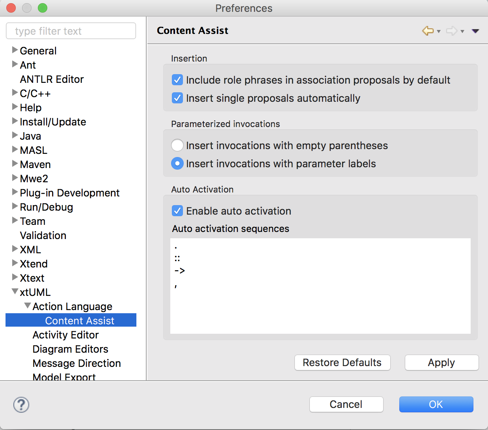

Content Assist Preferences
==========================

Content assist preferences can be accessed by selecting Window > Preferences >
xtUML > Action Language > Content Assist. ( BridgePoint > Preferences ... on Mac)

### Role phrases

A toggle button controls whether or not role phrases are included by default.
For reflexive associations, role phrases are required, but in other cases the
user can choose whether role phrases are included in proposals for link
traversals and relate/unrelate statements.

Help text:
> Include role phrases in association proposals by default

The default is to include role phrases.

### Invocation format

A radio button controls the format of parameterized invocation proposals. The
options are to either simply insert the proposal with open and close parentheses
and place the cursor between them, or to fill out the prototype of the signature
with parameters and place the cursor at the first parameter.

Help text:
> Include parameter tags in parameterized invocation proposals

The default is to fill out the parameters.

### Single proposals

A toggle button controls whether or not to automatically apply proposals that
are the only proposal in a list.

Help text:
> Insert single proposals automatically

The default is yes.

### Auto trigger

#### Auto trigger enable/disable

A toggle button controls whether auto triggering is enabled or disabled.

Help text:
> Enable auto activation

The default is enabled.

#### Auto trigger sequences

A text box allows a user can modify the character sequences which automatically
trigger completion assistance. Trigger sequences shall be separated on different
lines, and whitespace shall always be ignored.

Help text:
> Auto activation sequences for OAL (separate each sequence on a separate line)

If auto triggering is disabled, the text box is grayed out.

The default sequences are:
```
.
::
->
,
```


