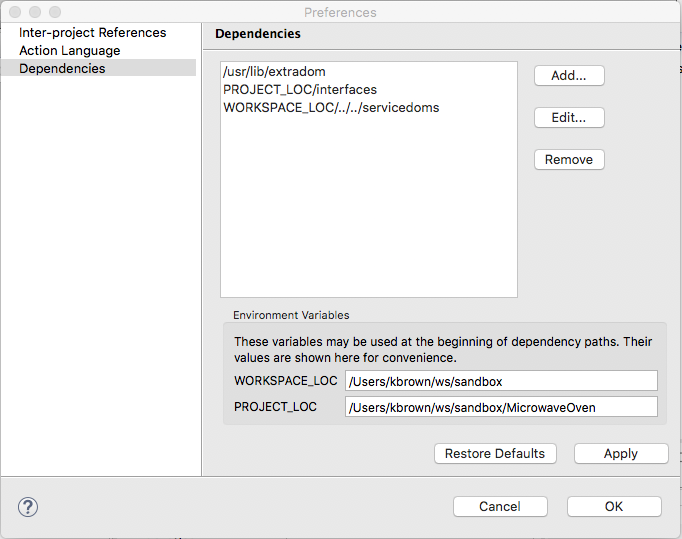

Project Dependencies 
========================

## Dependencies

The list box shows paths to files or folders that this project depends upon.  User
may `Add...`, `Edit...` or `Remove` a dependency from the list.   

The given list is persisted to the `.dependencies` file located direction under 
the project's location on disk.  

The paths may start with either of the variables `PROJECT_LOC` or `WORKSPACE_LOC`. These
variables are dynamic for each user.  Paths may also specify an absolute location.  

Currently, BridgePoint only uses this information for MASL activity validation.  However,
a custom down-stream tool could use this information for any purpose. When used for MASL 
projects, BridgePoint will include all `*.int` files directly under the specified directories 
in the activity validation process. Individual files may also be specified as dependencies.   

This preference page may be disabled by setting `-Dbridgepoint.Dependencies=disabled` at 
the end of the `bridgepoint.ini` file inside the installation.  

## Preference Page

    
