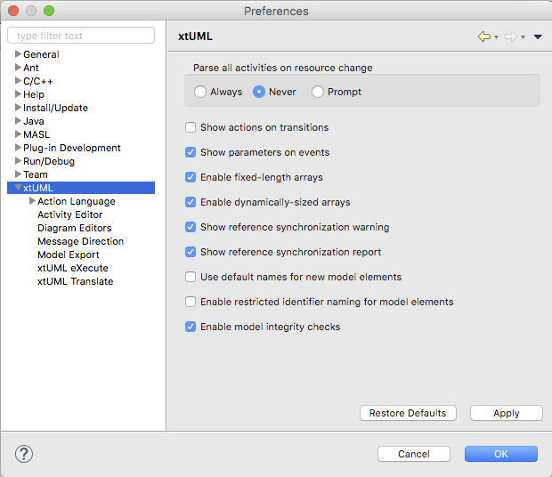

xtUML Preferences
========================

## Parse all activities on resource change

This setting controls whether or not the OAL parser shall re-parse all activities
when a structural change is made to the model.  This process may be time consuming
on large models.  

## Show actions on transitions  

Display (or not) the OAL of state transitions on the canvas of State Machine diagrams.  

## Show parameters on events  

Display (or not) the parameters of events associated with state transitions on the 
canvas of State Machine diagrams.  

## Enable fixed-length arrays

Allow (or not) models to use arrays that have fixed sizes.  

## Enable dynamically-sized arrays

Allow (or not) models to use arrays of variable size that may expand in length
at run time.  

## Show reference synchronization warning

Display (or not) a warning dialog containing any references that will be lost before synchronization.  

## Show  reference synchronization report

Display (or not) a report of changes to the model after reference synchronization.  

## Use default names for new model elements

When enabled BridgePoint will automatically name newly created structural model
elements.  When disabled BridgePoint will display a dialog to prompt the user to
enter a name for the new element.  

## Enable restricted identifier naming for model elements

When enabled all new elements and elements being renamed must follow the BNF rule: 
`( Letter | '_' )( Letter | Digit | '_')*;`.  

That is, identifiers may only contain letters, numbers, and underscores.  Spaces,
hyphens, and other characters are not allowed.  

## Enable model integrity checks

When enabled, model integrity checks run during most BridgePoint model operations
and validate the integrity of the model for the operation performed.  This can be
useful to assure there is no model corruption, but there is performance overhead
when enabled.  
 
## Preference Page  

    
