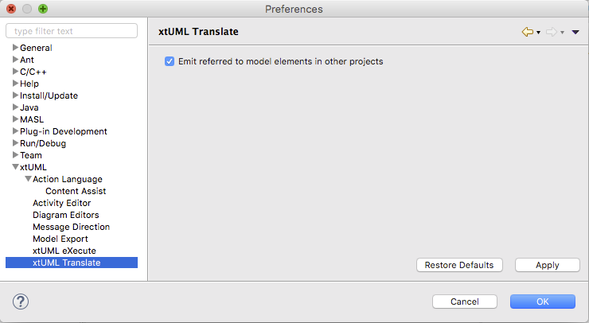

xtUML Translate Preferences
========================

## Emit referred to model elements in other projects

In the context of projects employing inter-project references, enabling this
option causes Model Compiler Pre-Build to follow and resolve references and 
output an aggregate file to pass to the model compiler tool chain.  

## Preference Page

    
