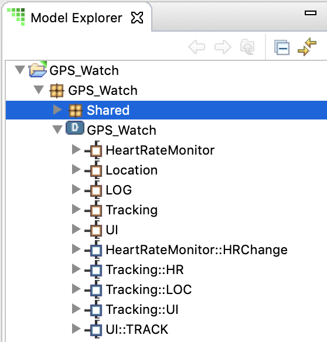
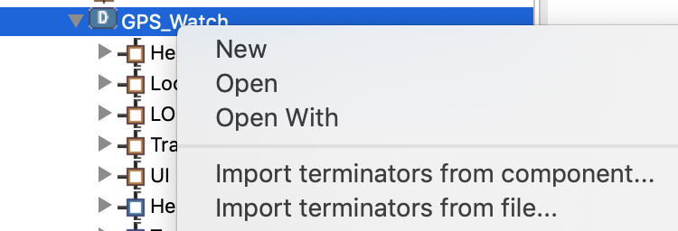
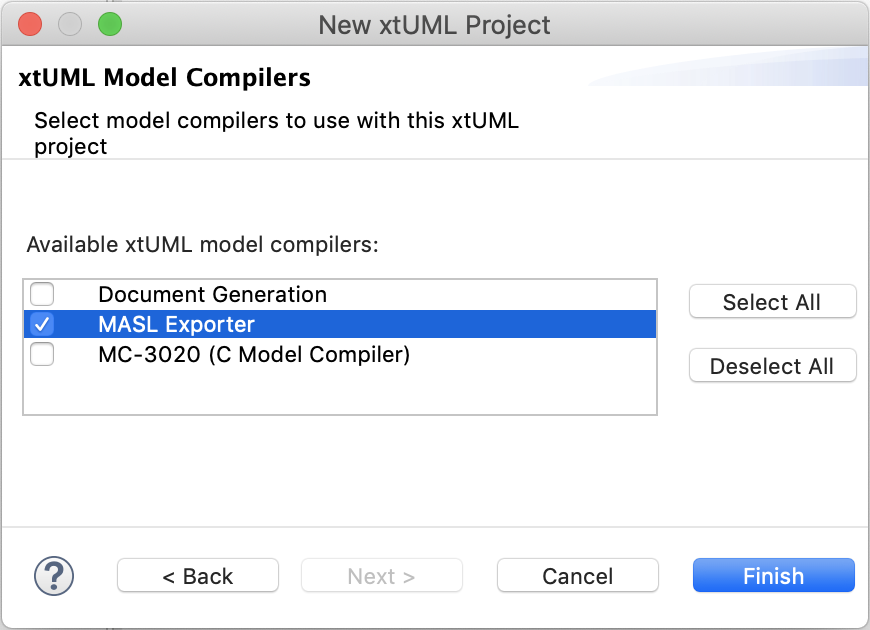
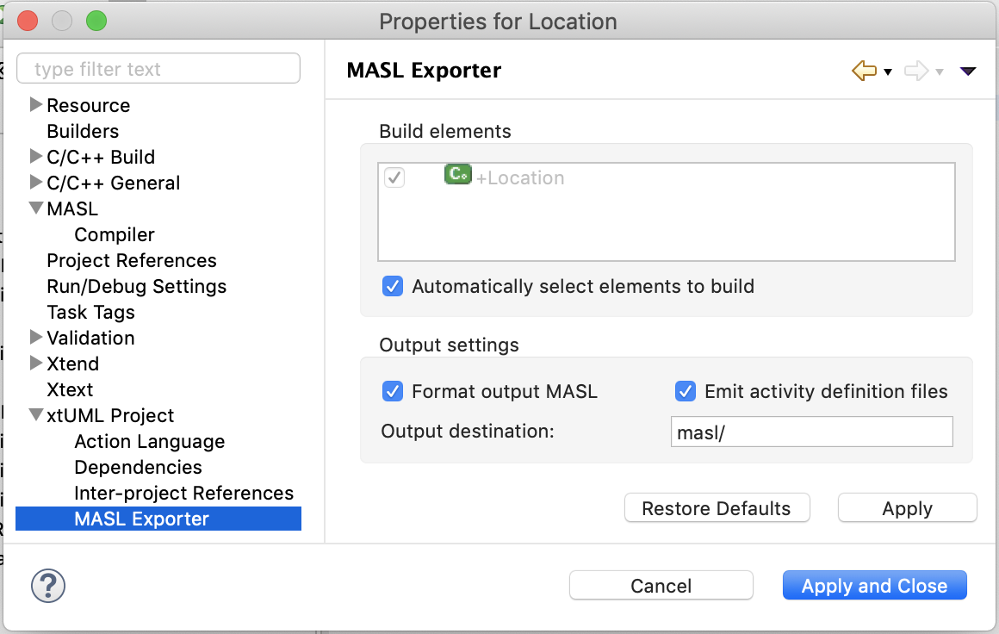

= What's New in BridgePoint 6.18

== Release Highlights
* Deployments
* MASL Output
* Marking Listener
* Build Tooling
* State Event Matrix Fixes

'''

=== Deployments
A new model element type named "Deployment" is introduced for system modeling. It
uses elements called "Terminators" and "Terminator Services" to specify connections
between components.  Deployments do not have graphics, but they are first-class
xtUML elements shown in Model Explorer.

Deployments are an alternative, not a replacement, for the long-standing xtUML 
approach of wiring together components graphically with provided and required
interfaces.  This alternative is primarily targeted at MASL modelers and provides
a more natural method of defining system level connections that are familiar with
ASL methodology.

.GPS Watch Deployment


The GPS Watch - MASL example project is modified to use deployments and is an
excellent reference to see the functionality in action.  The MASL Modeling and
Conversion Guide documentation in BridgePoint is updated with instructions for
modeling with Deployments.  New context menus are added to populate Deployments 
with terminator details either from interface files or from existing components.

.Context Menu Entries to Import Terminators



=== MASL Output

Various features and fixes are made to the MASL export flow. Highlights 
are listed here.

`xtuml2masl` is enhanced to work completely without eclipse.  This enhancement
is particularly useful when integrating `xtuml2masl` into a command line based
tool chain.  

The "Export MASL ..." context menus are deprecated.  MASL export is
now accomplished as part of the build process. Projects are configured to use
MASL Exporter as part of the model compiler selection. See "Build Tooling" 
below for important information about configuring existing projects to use
this builder.

.MASL Exporter Builder


Project preferences are added to control the functionality of MASL Exporter.
These preferences address feature requests to control whether MASL output
is formatted or not and to control the destination folder for the exported
files. 

.MASL Exporter Preferences


=== Marking Listener

BridgePoint supports two methods of marking.  This release enhances the functionality
of the marking method typically used by MASL models that relies on `application.mark` 
and `features.mark` files.

The tool now performs automatic updates to element markings stored in `application.mark`
as elements are renamed, moved, or change types or parameters. These automatic
updates are performed by a listener that runs in the background and responds to 
model changes. 

=== Build Tooling

*IMPORTANT:* A major upgrade of the BridgePoint model compilers is included
in this version of the tool.  Projects using model compilers created before 
this version must be upgraded. 
    
```
Use the following procedure to update existing models. It is recommended 
that projects that are not in revision control be backed up before an upgrade 
is attempted.

1. Right click on the project and select "Properties"

2. In the "Builders" section, select "Missing builder (org.xtuml.bp.mc.*.export_builder)" and click "Remove"

3. In the "Builders" section, select "Missing Compiler" and click "Remove"

4. Click "Apply and Close"

5. Right click on the project and select "BridgePoint Utilities > Set Model Compilers"

6. Follow the wizard to enable your desired model compiler(s)
```

Full details of the change, including new preference settings, and new project
wizard changes are detailed link:https://github.com/xtuml/bridgepoint/blob/master/doc-bridgepoint/notes/11491_mcs/11491_mcs_int.adoc[in this note]. 
    
Questions about model upgrade can be directed to the
link:https://hangouts.google.com/group/vMohZ9oW08xR7wSd2[xtUML Community Chat]
or to the link:https://xtuml.org/community/forum/xtuml-forum/[xtUML.org forums].
    
The "Build project" feature is extended with additional enhancements for 
consistent MASL export and clean build on Windows.   

=== State Event Matrix Fixes

Fixes are applied to the state event matrix table:

* A redraw issue is fixed on Linux that caused rows to display incorrect 
information as the mouse was moved around. 
* Additionally, a fix is applied that addresses an exception thrown in 
places where creation events are shown.

    