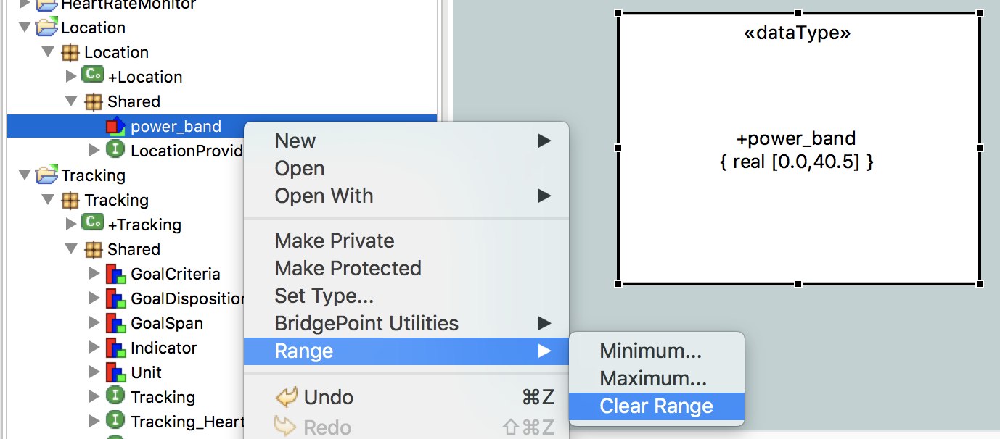
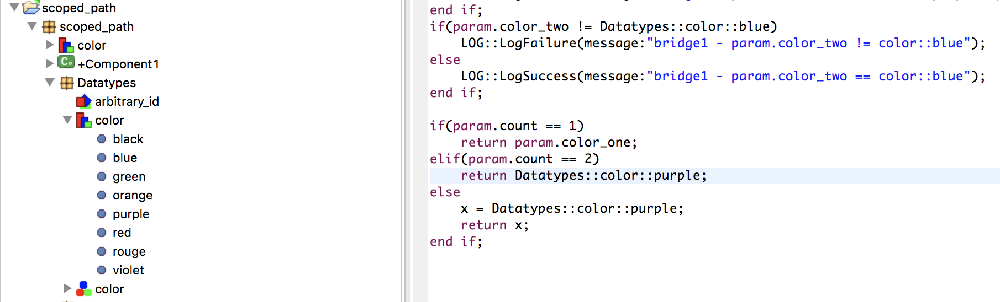
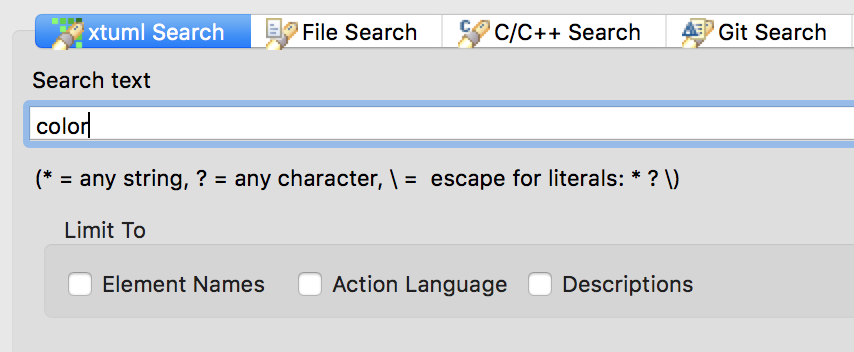

What's New in BridgePoint 6.14
========================

Release Highlights
-------
* Methodology Additions  
* User Interface 
* Model Compiler 
* MASL Support 

-------------------------------------------------------------------------------

Methodology Additions
------
####  Ranges of Data Types
BridgePoint now supports setting range minimum and maximum values on data types. The range
data is stored in an instance of `S_RANGE` that is associated with the type.  Either value
may be left unspecified.  The modeler may also clear the range data, which will dis-associate
and delete the `S_RANGE` instance.   

Range enforcement is not yet implemented in BridgePoint Verifier or model compilers.  

  

####  Constant based on user data type
In prior versions of the tool constants were only allowed to be typed with core 
types `boolean`, `integer`, `real`, and `string`.   

In this version constants may now be typed with these core types or User Defined Types based 
on `boolean`, `integer`, `real`, `string` or an enumerated data type. UDTs based on UDTs that
resolve back to one of the supported types may also be used.    
    

User Interface Enhancements
------
####  Scoped data types in OAL
BridgePoint OAL can now refer to types via scoped paths.  This allows modelers to have types
with the same name at various levels of the model and to disambiguate which one they are
referring to.   

xtUML visibility rules apply.  Users are only required to specify as much path as is necessary
to resolve conflicts.  This means that fully scoped paths are not required.  

  

####  Search of xtUML structural elements
xtUML search is extended to look for model elements by name.  This is in addition to the 
existing support for searching Descriptions and Action Language.  

Opening (double-clicking) individual search results will open the declaration of the 
model element.  

  

####  Element ordering in constant specifications 
BridgePoint is fixed to consistently display constants inside a constant specification with
a user-defined order.  Constants may now be moved up and down in the order.  Model Explorer
and the canvas both use the ordering.    
    
####  Updated GPS Watch example model
The GPS Watch example model available via `Help > Welcome > Quick Start` is now available
in both OAL and MASL forms.  The same structural model is used in both examples, with different
action languages used to perform the processing.   

BridgePoint will set the necessary application preferences for the type of model selected.   

Model Compiler Enhancements    
------
* BridgePoint now includes version 2 of the generator based on pyrsl/pyxtuml.
* Bug fix for invalid C code for associative traversals 
* Bug fix for instance already related when using interpret-based mc3020
    
MASL Support
------
* Bug fix for tool lockup
* Enhancement for UDT usage in MASL Projects
* Improved error reporting by MASL tools
* MASL compiler fixes and cleanup
* MASL testing enhancements
    