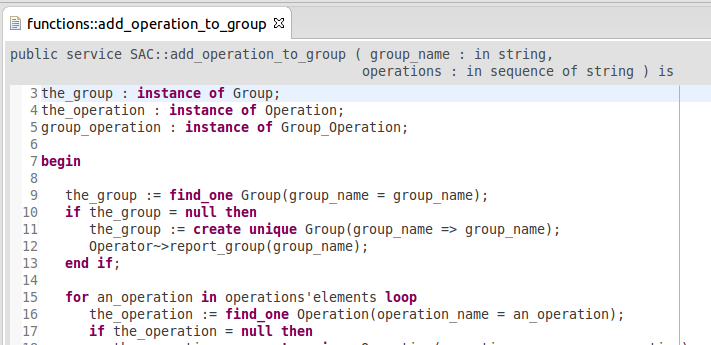
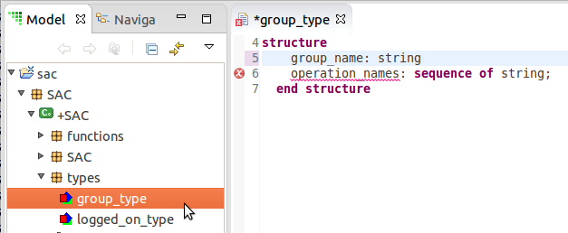

What's New in BridgePoint 6.2.1
========================

Release Highlights
-------
* MASL Editor
* MASL Flow
* OAL to MASL Converter

-------------------------------------------------------------------------------

MASL Editor
------
* BridgePoint now supports a single-activity MASL editor (Figure 1).  The editor 
displays the function signature at the top in a non-editable display field.  This
includes the return type as well as a listing of each parameter with associated 
type.  This editor continues to support full syntax highlighting for the MASL 
language.        

  
__Figure 1__  

* Additionally, BridgePoint now supports automatic reference maintenance, also 
known as rename/refactor.  This feature allows the user to rename a model element
(e.g. a function parameter) and the tool will automatically update the places in 
the action language where the element is used to have the new name.  

* Complex MASL types are now edited with a syntax checking editor (Figure 2). This 
helps users catch syntax issue on initial input rather than during downstream processing.  

  
__Figure 2__  

  
MASL Flow
------
This release includes many improvements in the convert/import/edit/export flow of MASL 
models:    

  * Better handling of referential attributes during the model conversion process.   
  * Fixes to comment handling
  * Deprecate the ```function``` keyword in MASL in favor of ```service```
  * Automated round trip (MASL -> xtUML -> MASL) testing  
  * Terminator services are now treated as ```public``` rather than ```private```
  * Better handling for large files and large activity bodies

OAL to MASL Converter
------
This release includes a tool that can convert OAL activities into MASL activities.
The tool is useful for getting a jumpstart on converting an xtUML model into a
MASL model.   

