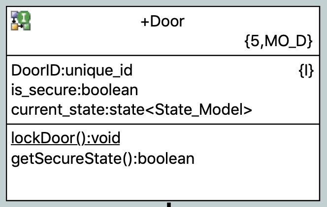
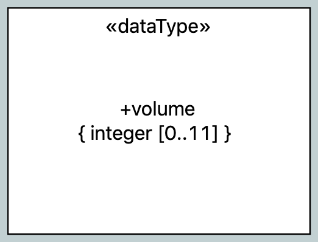

What's New in BridgePoint 6.16
========================

Release Highlights
-------
* Infrastructure 
* User Interface
* Model Compiler 

-------------------------------------------------------------------------------

Infrastructure 
------
#### Move to Eclipse Oxygen 

BridgePoint now runs on Eclipse Oxygen.  Prior versions ran on Eclipse Mars.  The user experience is 
not dramatically different, but the update of course includes new features and fixes from the Eclipse 
foundation.  Please see the article [Eclipse Oxygen - New and Noteworthy](https://www.eclipse.org/eclipse/news/4.7/) for more information.  

This update includes an update to Eclipse EGit 4.9.  See the [EGit - New and Noteworthy](https://wiki.eclipse.org/EGit/New_and_Noteworthy)
for details about updates to this tool.  

#### Completed migration to generator 2.0

BridgePoint model compilers have incrementally moved to the python-based generator 2.0 (pyrsl) over the 
previous releases.  This release completes the migration with updates to the Java model compiler used to 
build BridgePoint itself.  

With this change there is no longer a requirement to downgrade generator to build BridgePoint. This improves
the experience for BridgePoint developers and keeps full self-hosted development and build in place.  

User Interface
------
#### Visual cues and improvements  

Two enhancements have been made to the xtUML Editor based on user requests.  First, class-based operations 
are now shown with an underline on the class diagram.  Instance-based operations are shown without underlining.  

  

Second, the separator for ranges on UDTs is changed from `,` to `..`.  

  

#### OAL editor automatic indentation

The OAL editor now performs automatic indentation of the next line when the user creates
a conditional block or a loop.  Specifically, an additional level of indentation to the current line 
is automatically inserted when the user hits "enter/return" at the end of a line that contains
`if`, `elif`, `else`, `for each`, or `while`.  

All indentation (automatic or manual) is fixed to properly indent with spaces or tabs using the 
user-specified settings for tab width and "Insert spaces for tabs".  These settings are configured 
in the BridgePoint preferences at `General > Editors > Text Editors`.   

#### Other UI enhancements and fixes
* Fix to xtUML eXecute Application launch configurations to allow an initializer interface message to run at startup   
* Fix  OAL completion suggestions for constants   
    
Model Compiler
-----
#### MC-3020 enhancements
__State Save__ -  A state save contains encoded information representing the current_state of each 
running state machine in the model as well as the sequences of events on the event queues. A marking 
is supplied to enable and configure the state save feature. State Save is accessed in application 
models via an External Entity with bridges to trigger state save and read previously saved state.  

__Simulated Time__ - Simulated Time in MC-3020 implements a form of discrete event simulation. In simulated 
time mode, no external clock is read. The application runs as fast as the architecture allows. The time 
base is derived from timers used to cause functional delays in the production application.   

__Class-specific Tracing__ - Functionality is added in MC-3020 for classes to trace state machine state 
transitions and to trace individual action language statements. A mechanism is provided to enable or disable 
this tracing functionality on a class by class basis. A marking is supplied to identify which classes are 
included in or excluded from tracing.   

__Persistence__ - Add the ability to persist instance data so that it survives across power cycles 
(down and up). The instances that are present when power is removed are automatically restored when 
power returns. Links between persistent instances are also saved and restored to and from non-volatile 
storage (NVS).  

__Keyed Timers__ - Keyed timers have been an undocumented feature for several years. This work makes 
keyed timers the default implementation generated by the model compilers. Keyed timers prevent the 
accidental reuse of an expired timer and prevent one part of the application from canceling a timer 
started by another part of the application. It does this by assigning a unique access key. The access 
key is carried by the owner (who started the timer) and is passed in to gain access to the timer methods.
  

#### Other MC enhancements and fixes
* Updates for referential attribute processing for reflexive associations   
* Use mcmc.exe on Windows   
* Tag interface messages as safe for interrupts.   
* Fix batch relate to handle string instance identifiers   
* Updates for polymorphic event handling when sent to self within subtype    
    