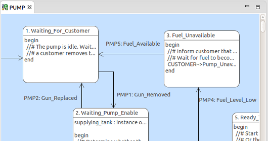

What's New in BridgePoint 5.8.5
========================

Release Highlights
-------
* Package References
* Model Element Move
* Activities Persisted in Files
* Verifier
* MASL
* Editor

-------------------------------------------------------------------------------

Package References
------
To formalize the use of shared class models, support for package references is
being added to BridgePoint.  


  
Package References allow the modeler to explicitly give local visibility to
elements that exist inside another package.  A package must be empty and located
directly inside a component to be assignable as a package reference.  The target
package being referred to may exist in the same project or in another project.  
  
Package references are supported in the BridgePoint model compilers.  Documentation
exists in the BridgePoint Help system that explains Package References in detail. 
It is at ```BridgePoint UML Suite Help > Reference > UserInterface > PackageReferences```.  


Model Element Move
------    
BridgePoint now supports moving model elements via Cut & Paste.  As opposed to 
prior versions where this action performed a copy/delete/create process, this
version truly moves model elements from one location to another.  This means that
underlying UUIDs of model elements are _not_ recalculated, making the move operation
much safer and user-friendly.  

The tool also recognizes if the user is moving elements to new locations where 
referring elements do not have visibility.  It will display a warning in this case
telling the user what model elements will be affected and downgraded to default
values (or deleted in the case of imported classes and component references).  The 
modeler is given the option to cancel the operation.  BridgePoint
also supports undo-ing the move after it has occurred.  

Activities Persisted in Files
------    
This version of BridgePoint persists action language activities in files separate
from the structural model data in the ```.xtuml``` file.  All the sibling activities 
for a given parent are persisted into the same file.   
  
This change is related to a metamodel update.  BridgePoint now has a ```Dialect```
attributes on action home instances.  Any class that had ```Action_Semantics``` now
has a ```Dialect``` attribute.   

Verifier
------
A number of features and fixes were made to improve Verifier:
* Improved handling when making consecutive calls to a bridge when a parameter is sent by reference
* Fixed Stack Overflow Error that occurred when breakpoints set in code manipulating combined reflexive and non-reflexive associations
* Audit Realized Bindings now reloads java classes
* Realized structured data types now handle primitive types
* BPClassLoader now closes the file stream after loading .class files

MASL
------
Improvements continue to be made in MASL support throughout the 
convert/import/edit/export flow. The MASL editor now supports context-sensitive 
edit/completion assistance in addition to syntax highlighting.  
  
In addition, MASL is now displayed on state model canvas.  




Editor
------
This release adds a number of improvements to the xtUML Editor.  Here are a few 
of the highlights:  
* Fixed an issue with the context-menu filtering that was allowing operations to
be available on the context-menu when they should not.
* Changes to interfaces are now only allowed on the interface definition.  Modelers
are no longer allowed to make changes on any interface references associated with ports.
* The BridgePoint OAL marker extension is changed from ```.oal``` to ```.oal_err```.  This
is in preparation for a change that will come in the future where BridgePoint saves OAL
text in ```.oal``` files instead of inside the instance data in the ```.xtuml``` files.
    
