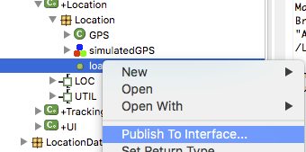

What's New in BridgePoint 6.10.0
========================

Release Highlights
-------
* OAL Content Assist Improvements 
* "Publish to Interface..." Tool
* Editor Enhancements
* MASL Flow Improvements  
* Concrete Polymorphic Events

-------------------------------------------------------------------------------

OAL Content Assist Improvements
------
The OAL content assist feature is improved in this release.  Specifically, BridgePoint has improved 
proposals in `relate`, `unrelate`, and `create` statements and numerous places where `self` and `param` 
may be used.  

Additionally, a bug is fixed where content assist raised a selection list at the end of a comment.  

Publish to Interface
------
Some modelers prefer to create their application from a domain-first, bottom-up approach.  This approach typically
involves the creation of domain functions that help define the API provided by the domain.  When the time comes to
wire the component into a full system, the modeler is left to manually create interfaces and messages that expose 
the API.  

To simplify this process, BridgePoint now includes a `Publish to Interface...` tool [Figure 1].  This tool creates 
interface messages and parameters automatically from the selected domain functions.  The tool is smart enough to 
update existing messages when applicable and handle situations where ambiguity exists.

__Figure 1__  

Editor Enhancements
------
Ongoing improvements and fixes in the model editor continue.  

Handling of referential attributes and the rules that govern when referentials and identifiers may be combined are improved.   

A fix is made to the handling of the parameter list for class-based operation parameters if a user-defined 
datatype from another package is used.   

During paste of a class, the class number is now updated automatically so the modeler is saved making the modification
himself to avoid duplicate class number errors.    

MASL Flow Improvements  
------
All areas of the MASL to xtUML experience are improved. Several import and export issues are addressed. Types,
subtype classes, and terminators are now exported cleanly to feed into downstream MASL tools.   

Additionally, the MASL editing inside BridgePoint is more robust, specifically in the area of handling the 
synchronization of data stored on disk versus displayed in the editor.  Problems that lead to the "data out of synch" 
error dialog have been addressed.  

Concrete Polymorphic Events
------
The implementation of the behavior of polymorphic events as defined in the Schlaer-Mellor Method diverged over time in BridgePoint and iUML.  BridgePoint/xtUML defined polymorphic events 
as "abstract".  It defined that polymorphic events may be handled at only one level of the supertype/subtype
hierarchy.  

On the other hand, iUML/MASL defined polymorphic events as "concrete".  It defined that polymorphic events must
be handled at every level of the supertype/subtype hierarchy.  

As part of the improvement of MASL capabilities BridgePoint now supports concrete polymorphic events.  The feature
is enabled with an installation-level setting and should only be used for models that use MASL action language.   

