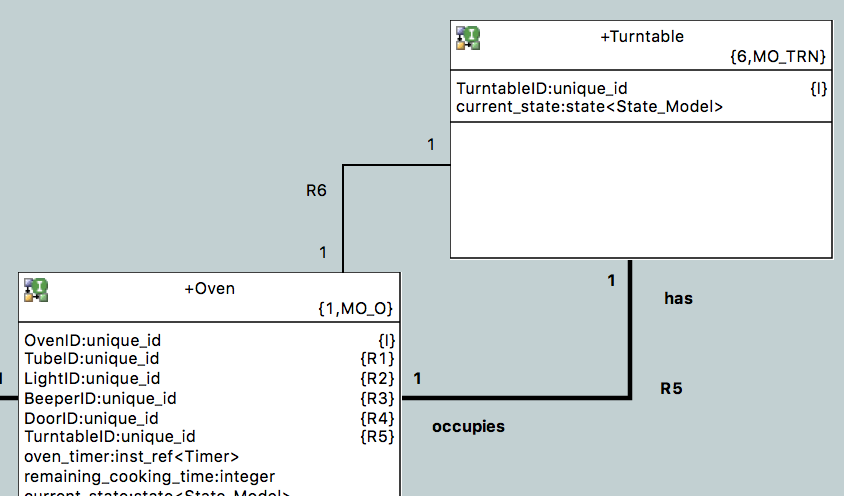
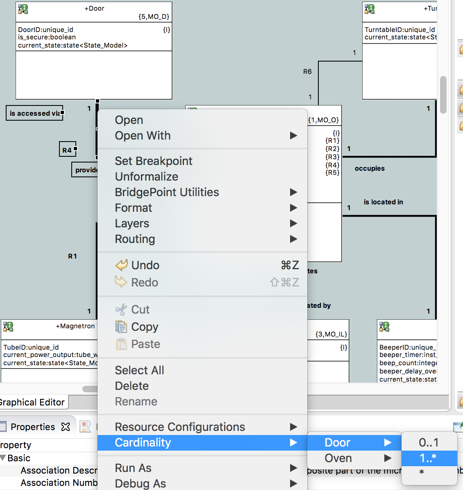

What's New in BridgePoint 6.6.0
========================

Release Highlights
-------
* Movable Associations
* Integrity Checker
* Feedback on Formalized Associations
* Edit Cardinality from Context Menu
* Customizable User Interface
* Automatic Interface Management
* Enhancements for Constants
* Referential Attribute Combinations

-------------------------------------------------------------------------------

Movable Associations
------
Users may now drag and drop associations on a diagram to move relationships from
one class to another.  During the move, formalized associations are automatically
unformalized.  They are not automatically formalized when dropped on the new target
class.  BridgePoint prevents modelers from creating invalid relationships during
the move.  

Integrity Checker
------
BridgePoint includes a new tool that performs deep analysis of model instance data.  The
tool may be run from the command line or from the UI context menu at 
`BridgePoint Utilities > Check Referential Integrity`.  

Check Referential Integrity runs a model data consistency query. Model data is loaded 
directly from the file system and interrogated against a set of rules and assertions. Since 
model data is well-formed and must be compliant with a data base schema, many checks 
can be made to detect problems and corruption in the data.  

Additional info may be found in the Help at "BridgePoint UML Suite Help > Reference > Check Referential Integrity".  
    
Feedback on Formalized Associations
------
Formalized associations are now shown in bold on class diagrams.  This allows the modeler to 
quickly see which associations are formalized and which are not.  This feature may be disabled
in the xtUML preferences to use prior behavior where there is no visible difference in 
association types.   

Figure 1 shows the new feature in action.  R6 is unformalized. R5 is formalized, the referential attribute
`TurntableID` is stored in `Oven`.  

__Figure 1__  

Edit Cardinality from Context Menu
------
Modelers may now edit the cardinality of association ends directly from the context menu.  This usability
enhancement provides a much faster editing experience over going to the Properties view to make the same changes.

__Figure 2__  

Customizable User Interface
------
Users may now modify the BridgePoint contributions to the context menu and the canvas palette.  This allows
the modeler to hide menu entries and tools that are of no interest.  

For example, a modeler who focuses on OAL-based modeling may disable the `Export MASL Domain` and `Manage Project Markings`
menu entries.  Or perhaps the modeler is only interested in executable xtUML functionality and therefore disables
tools for drawing Use Case, Interaction, and Sequence diagrams (Figure 3).  

This new feature is described in detail in the help system at "BridgePoint UML Suite Help > Reference > User Interface > Palette and Context Menu Customization".

The BridgePoint menu contributions have also been simplified and reorganized to improve usability.  

__Figure 3__  

Automatic Interface Management
------
For MASL modelers, BridgePoint now automatically synchronizes interface references when the tool determines that 
references need to be updated.  Manual synchronization is no longer required.  

For OAL modelers, the tool still decorates the referring model with warning symbols and requires manual 
synchronization.  Thus, there is no change to existing synchronization behavior for OAL users.

Enhancements for Constants
------
xtUML constants may now be scoped by the name of the constant specification in OAL activities. The scoping 
rules follow the same syntax as scoping enumerations in enumerated types.  

Modelers are not required to use the new functionality.  OAL continues to support unscoped constants (if 
they are globally unique).

Model compiler authors should note that this feature necessitated a small change to the model compiler 
schema file `xtumlmc_schema.sql`.

Referential Attribute Combinations
------
BridgePoint has long supported the ability to combine referential attributes, with the restriction that that
the attributes being combined must refer back to the same base attribute.  

In response to user requests, this restriction has been loosened.  Referential attributes may now be combined
if they are of the same type, regardless of what base attribute they refer to.  For example, modelers may now
merge identifiers from two super types in a subtype class.   

Other Notable Fixes
------
This release includes a number of other enhancements and bug fixes to improve usability
of the tool:  

* Existing xtUML projects are now always shown in Model Explorer after import   
* In the Properties view for classes, move `Attribute Prefix Name` and `Attribute Prefix Type` together  
* Always create folder `gen/code_generation` during project build if it does not exist  
